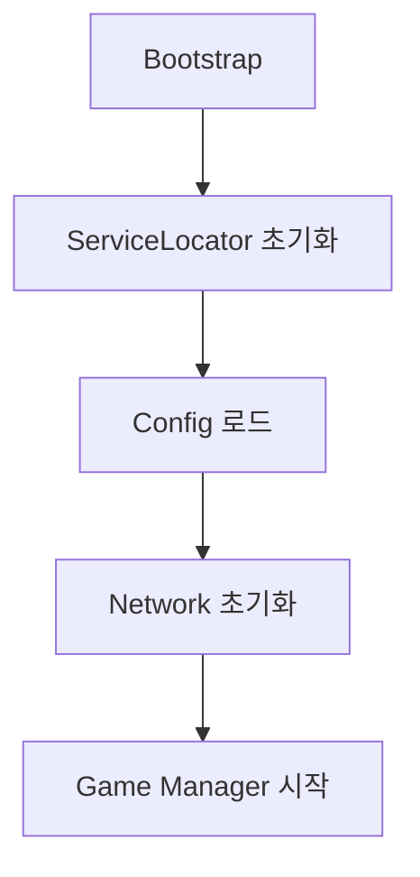
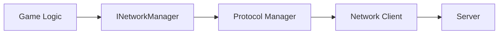
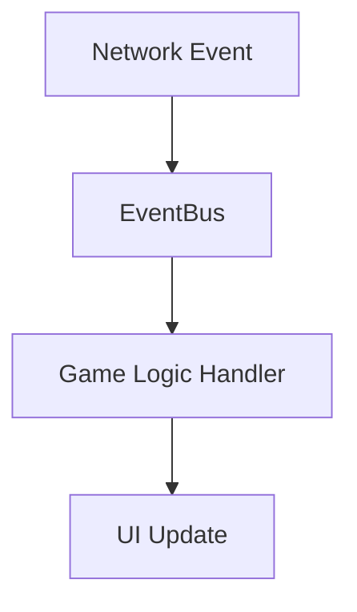

# Police-Thief 프로젝트 아키텍처

## 개요

Police-Thief는 실시간 멀티플레이 게임으로, 현대적인 네트워크 프로토콜과 모듈러 아키텍처를 기반으로 구축되었습니다. QUIC, gRPC, TCP 등 다양한 프로토콜을 지원하며, Unity 환경에서 최적화된 성능을 제공합니다.

## 전체 아키텍처

```
Police-Thief/
├── Core/                    # 핵심 시스템들
│   ├── Config/             # 설정 관리
│   ├── DI/                 # 의존성 주입
│   ├── Events/             # 이벤트 버스
│   ├── Logging/            # 로깅 시스템
│   ├── Pool/               # 오브젝트 풀링
│   └── State/              # 상태 관리
├── Infrastructure/         # 인프라스트럭처
│   └── Network/            # 네트워크 계층
│       ├── Core/           # 네트워크 핵심
│       ├── QUIC/           # QUIC 프로토콜
│       ├── gRPC/           # gRPC 클라이언트
│       ├── TCP/            # TCP 클라이언트
│       └── Interfaces/     # 네트워크 인터페이스
├── Game/                   # 게임 로직
│   ├── Base/               # 기본 엔티티
│   ├── Interfaces/         # 게임 인터페이스
│   └── Logic/              # 비즈니스 로직
├── Presentation/           # 프레젠테이션 계층
└── Test/                   # 테스트 코드
```

## 핵심 설계 원칙

### 1. 모듈러 아키텍처
- **관심사 분리**: 각 모듈은 단일 책임을 가짐
- **느슨한 결합**: 인터페이스를 통한 의존성 관리
- **높은 응집도**: 관련 기능들을 모듈별로 그룹화

### 2. 의존성 주입 패턴
```csharp
// ServiceLocator를 통한 의존성 관리
var networkConfig = ServiceLocator.Instance.Get<NetworkConfig>();
var networkManager = ServiceLocator.Instance.Get<INetworkManager>();
```

### 3. 이벤트 주도 아키텍처
```csharp
// EventBus를 통한 느슨한 결합
EventBus.Instance.Subscribe<PlayerJoinedEvent>(OnPlayerJoined);
EventBus.Instance.Publish(new GameStartEvent());
```

## 계층별 상세 설명

### Core 계층

핵심 인프라스트럭처를 제공하는 계층으로, 모든 상위 계층에서 활용됩니다.

#### Config 시스템
```csharp
public class NetworkConfig
{
    public string quicHost = "localhost";
    public int quicPort = 5000;
    public int connectTimeoutMs = 5000;
    public bool enable0Rtt = true;
    public bool enableConnectionMigration = true;
}
```

**특징:**
- JSON/XML 기반 설정 파일 지원
- 런타임 설정 변경 가능
- 환경별 설정 분리 (Development, Production)

#### DI (ServiceLocator)
```csharp
// 서비스 등록
ServiceLocator.Instance.Register<INetworkManager>(new NetworkConnectionManager());

// 서비스 사용
var networkManager = ServiceLocator.Instance.Get<INetworkManager>();
```

**특징:**
- 싱글톤 패턴 기반
- 타입 안전성 보장
- 인터페이스 기반 의존성 관리

#### Event 시스템
```csharp
// 이벤트 정의
public class NetworkConnectedEvent
{
    public NetworkProtocol Protocol { get; set; }
    public string ConnectionId { get; set; }
}

// 이벤트 발행/구독
EventBus.Instance.Subscribe<NetworkConnectedEvent>(OnNetworkConnected);
EventBus.Instance.Publish(new NetworkConnectedEvent { Protocol = NetworkProtocol.QUIC });
```

### Infrastructure 계층

#### Network 아키텍처
```
INetworkManager (인터페이스)
    ├── NetworkConnectionManager (구현체)
    ├── ConnectionPool (연결 풀)
    └── Protocol Managers
        ├── QuicProtocolManager
        ├── GrpcProtocolManager
        └── TcpProtocolManager
```

**주요 특징:**
- 프로토콜별 독립적 관리
- 연결 풀링으로 리소스 최적화
- 자동 재연결 및 오류 복구

### Game 계층

#### 게임 로직 아키텍처
```csharp
public abstract class GameEntity : MonoBehaviour
{
    protected virtual void Initialize() { }
    protected virtual void UpdateEntity() { }
}

public class LoginManager : GameEntity
{
    public async Task<bool> LoginAsync(string userId, string password)
    {
        // gRPC를 통한 로그인 처리
        var grpcManager = ServiceLocator.Instance.Get<INetworkManager>()
            .GetProtocolManager<GrpcProtocolManager>();
        
        return await grpcManager.LoginAsync(userId, password);
    }
}
```

## 데이터 흐름

### 1. 클라이언트 초기화


### 2. 네트워크 통신


### 3. 이벤트 처리


## 성능 최적화

### 1. 오브젝트 풀링
```csharp
// NetworkMessage 풀링
var message = PooledNetworkMessage.Get(MessageType.GameData, data, 0, data.Length);
// 사용 후 자동 반환
message.Dispose();
```

### 2. 메모리 최적화
- ArraySegment를 통한 제로 카피
- 구조체 기반 메시지 (NetworkStatsOptimized)
- 스택 할당 우선 사용

### 3. 네트워크 최적화
- QUIC의 0-RTT 연결
- 메시지 배칭
- 압축 및 직렬화 최적화

## 확장성

### 1. 새로운 프로토콜 추가
```csharp
// 1. IProtocolManager 구현
public class WebSocketProtocolManager : IProtocolManager
{
    // 구현
}

// 2. NetworkConnectionManager에 등록
networkManager.RegisterProtocolManager(NetworkProtocol.WebSocket, wsManager);
```

### 2. 새로운 게임 모드 추가
```csharp
// GameEntity 상속하여 새로운 게임 로직 구현
public class DeathMatchManager : GameEntity
{
    // 게임 모드별 로직 구현
}
```

### 3. 새로운 이벤트 타입 추가
```csharp
// 이벤트 정의
public class CustomGameEvent
{
    public string EventType { get; set; }
    public object Data { get; set; }
}

// 핸들러 등록
EventBus.Instance.Subscribe<CustomGameEvent>(HandleCustomEvent);
```

## 배포 전략

### 1. 환경별 설정
```json
{
  "Development": {
    "quicHost": "localhost",
    "quicPort": 5000,
    "logLevel": "Debug"
  },
  "Production": {
    "quicHost": "game-server.com",
    "quicPort": 443,
    "logLevel": "Info"
  }
}
```

### 2. Unity 빌드 최적화
- IL2CPP 백엔드 사용
- 코드 스트리핑 활성화
- 플랫폼별 최적화 설정

## 모니터링 및 디버깅

### 1. 로깅 시스템
```csharp
Log.Info("네트워크 연결 성공", "Network");
Log.Error($"연결 실패: {ex.Message}", "Network");
Log.Debug("디버그 정보", "Game");
```

### 2. 성능 메트릭
```csharp
// 네트워크 통계
var stats = quicClient.Statistics;
Log.Info($"RTT: {stats.GetAverageRTT()}ms, Loss: {stats.GetPacketLossRate()}%");
```

### 3. Unity Profiler 통합
- 커스텀 프로파일러 마커 추가
- 메모리 사용량 추적
- CPU 병목 지점 식별

## 보안 고려사항

### 1. 네트워크 보안
- QUIC의 내장 TLS 1.3 암호화
- gRPC의 SSL/TLS 지원
- 인증 토큰 관리

### 2. 데이터 검증
- 클라이언트 입력 검증
- 서버 사이드 검증
- 치팅 방지 메커니즘

## 다음 단계

이 아키텍처 문서를 바탕으로 다음 문서들을 참조하세요:

1. [Core Systems Guide](./02_Core_Systems.md) - 핵심 시스템 사용법
2. [Network Infrastructure](./03_Network_Infrastructure.md) - 네트워크 상세 구현
3. [Game Logic](./04_Game_Logic.md) - 게임 로직 구현
4. [Performance Optimization](./05_Performance_Optimization.md) - 성능 최적화
5. [Extension Guide](./06_Extension_Guide.md) - 확장 방안