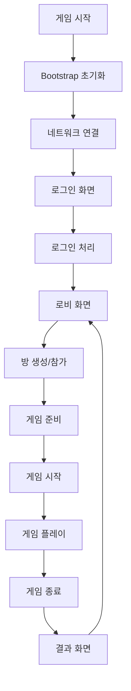

# Game Logic 상세 가이드

## 개요

Police-Thief 게임 로직은 모듈러 아키텍처를 기반으로 구축되어, 확장성과 유지보수성을 고려하여 설계되었습니다. Core 시스템과 Network Infrastructure를 기반으로 게임 특화 기능들을 구현하며, 실시간 멀티플레이어 환경에서 안정적으로 동작합니다.

## 목차
1. [게임 아키텍처 개요](#게임-아키텍처-개요)
2. [GameEntity 시스템](#gameentity-시스템)
3. [LoginManager 구현](#loginmanager-구현)
4. [RoomManager 구현](#roommanager-구현)
5. [GameManager 구현](#gamemanager-구현)
6. [플레이어 시스템](#플레이어-시스템)
7. [게임 상태 관리](#게임-상태-관리)
8. [실시간 동기화](#실시간-동기화)
9. [이벤트 시스템 통합](#이벤트-시스템-통합)

---

## 게임 아키텍처 개요

### 계층 구조

```
Presentation Layer (UI)
    ├── GameManager (전체 게임 관리)
    └── UI Components
    
Game Logic Layer
    ├── LoginManager (로그인/인증)
    ├── RoomManager (방 관리)
    ├── PlayerManager (플레이어 관리)
    └── GameSession (게임 세션)
    
Entity Layer
    ├── GameEntity (기본 엔티티)
    ├── Player (플레이어)
    ├── Room (게임방)
    └── GameState (게임 상태)
    
Infrastructure Layer
    ├── Core Systems (Config, DI, Events, Logging)
    └── Network (QUIC, gRPC, TCP)
```

### 게임 플로우



---

## GameEntity 시스템

### 개요
GameEntity는 모든 게임 오브젝트의 기반이 되는 추상 클래스로, 공통적인 생명주기 관리와 네트워킹 기능을 제공합니다.

### GameEntity 기본 구현

```csharp
public abstract class GameEntity : MonoBehaviour
{
    [Header("Entity Settings")]
    [SerializeField] protected string entityId;
    [SerializeField] protected bool isNetworked = true;
    
    protected bool _isInitialized = false;
    protected INetworkManager _networkManager;
    protected ILogger _logger;
    
    // 생명주기 이벤트
    public event Action<GameEntity> OnInitialized;
    public event Action<GameEntity> OnDestroyed;
    
    // 네트워크 이벤트
    public event Action<GameEntity, NetworkMessage> OnNetworkMessage;
    
    public string EntityId => entityId;
    public bool IsInitialized => _isInitialized;
    public bool IsNetworked => isNetworked;
    
    protected virtual void Awake()
    {
        if (string.IsNullOrEmpty(entityId))
        {
            entityId = GenerateEntityId();
        }
        
        // 의존성 주입
        _networkManager = ServiceLocator.Instance.Get<INetworkManager>();
        _logger = ServiceLocator.Instance.Get<ILogger>();
    }
    
    protected virtual void Start()
    {
        Initialize();
    }
    
    protected virtual void OnDestroy()
    {
        Cleanup();
        OnDestroyed?.Invoke(this);
    }
    
    /// <summary>
    /// 엔티티 초기화 - 상속 클래스에서 구현
    /// </summary>
    protected virtual void Initialize()
    {
        if (_isInitialized)
            return;
        
        _isInitialized = true;
        
        // 네트워크 이벤트 구독
        if (isNetworked && _networkManager != null)
        {
            SubscribeToNetworkEvents();
        }
        
        _logger?.Log(LogLevel.Debug, $"GameEntity {entityId} initialized", "Game");
        OnInitialized?.Invoke(this);
    }
    
    /// <summary>
    /// 엔티티 업데이트 - 상속 클래스에서 구현
    /// </summary>
    protected virtual void UpdateEntity()
    {
        // Override in derived classes
    }
    
    /// <summary>
    /// 엔티티 정리 - 상속 클래스에서 구현
    /// </summary>
    protected virtual void Cleanup()
    {
        if (isNetworked)
        {
            UnsubscribeFromNetworkEvents();
        }
        
        _isInitialized = false;
        _logger?.Log(LogLevel.Debug, $"GameEntity {entityId} cleaned up", "Game");
    }
    
    /// <summary>
    /// 네트워크 메시지 처리
    /// </summary>
    protected virtual void HandleNetworkMessage(NetworkMessage message)
    {
        OnNetworkMessage?.Invoke(this, message);
        
        switch (message.messageType)
        {
            case MessageType.GameData:
                ProcessGameData(message.payload);
                break;
            case MessageType.PlayerAction:
                ProcessPlayerAction(message.payload);
                break;
        }
    }
    
    /// <summary>
    /// 게임 데이터 처리 - 상속 클래스에서 구현
    /// </summary>
    protected virtual void ProcessGameData(byte[] data)
    {
        // Override in derived classes
    }
    
    /// <summary>
    /// 플레이어 액션 처리 - 상속 클래스에서 구현
    /// </summary>
    protected virtual void ProcessPlayerAction(byte[] data)
    {
        // Override in derived classes
    }
    
    /// <summary>
    /// 네트워크 메시지 전송
    /// </summary>
    protected async Task<bool> SendNetworkMessage(MessageType type, byte[] data)
    {
        if (!isNetworked || _networkManager == null)
            return false;
        
        try
        {
            var message = new NetworkMessage
            {
                messageType = type,
                payload = data
            };
            
            // QUIC를 우선 사용, 실패 시 TCP 폴백
            if (_networkManager.IsConnected(NetworkProtocol.QUIC))
            {
                var quicManager = _networkManager.GetProtocolManager<QuicProtocolManager>();
                var quicClient = quicManager.GetClient();
                return await quicClient.SendAsync(message);
            }
            else
            {
                _logger?.Log(LogLevel.Warning, "QUIC not available, message queued", "Game");
                // TCP 폴백 또는 메시지 큐잉
                return false;
            }
        }
        catch (Exception ex)
        {
            _logger?.Log(LogLevel.Error, $"Failed to send network message: {ex.Message}", "Game");
            return false;
        }
    }
    
    private void SubscribeToNetworkEvents()
    {
        if (_networkManager != null)
        {
            // 네트워크 매니저 이벤트 구독
            var quicManager = _networkManager.GetProtocolManager<QuicProtocolManager>();
            if (quicManager != null)
            {
                var quicClient = quicManager.GetClient();
                quicClient.OnMessageReceived += HandleNetworkMessage;
            }
        }
    }
    
    private void UnsubscribeFromNetworkEvents()
    {
        if (_networkManager != null)
        {
            var quicManager = _networkManager.GetProtocolManager<QuicProtocolManager>();
            if (quicManager != null)
            {
                var quicClient = quicManager.GetClient();
                quicClient.OnMessageReceived -= HandleNetworkMessage;
            }
        }
    }
    
    private string GenerateEntityId()
    {
        return $"{GetType().Name}_{Guid.NewGuid().ToString("N")[..8]}";
    }
}
```

### NetworkedGameEntity 확장

```csharp
/// <summary>
/// 네트워킹 특화 GameEntity
/// </summary>
public abstract class NetworkedGameEntity : GameEntity
{
    [Header("Network Settings")]
    [SerializeField] protected bool autoSyncTransform = true;
    [SerializeField] protected float syncInterval = 0.1f; // 100ms
    
    private float _lastSyncTime;
    private Vector3 _lastPosition;
    private Quaternion _lastRotation;
    
    protected override void Initialize()
    {
        base.Initialize();
        
        if (autoSyncTransform)
        {
            InvokeRepeating(nameof(SyncTransform), syncInterval, syncInterval);
        }
    }
    
    protected override void UpdateEntity()
    {
        base.UpdateEntity();
        
        // Transform 변경 감지 및 동기화
        if (autoSyncTransform && HasTransformChanged())
        {
            QueueTransformSync();
        }
    }
    
    private bool HasTransformChanged()
    {
        return Vector3.Distance(transform.position, _lastPosition) > 0.01f ||
               Quaternion.Angle(transform.rotation, _lastRotation) > 1f;
    }
    
    private void QueueTransformSync()
    {
        if (Time.time - _lastSyncTime < syncInterval)
            return;
        
        _lastSyncTime = Time.time;
        _lastPosition = transform.position;
        _lastRotation = transform.rotation;
        
        // Transform 데이터 직렬화
        var transformData = new TransformData
        {
            entityId = entityId,
            position = transform.position,
            rotation = transform.rotation,
            timestamp = DateTime.UtcNow.Ticks
        };
        
        var data = JsonUtility.ToJson(transformData);
        var bytes = System.Text.Encoding.UTF8.GetBytes(data);
        
        _ = SendNetworkMessage(MessageType.GameData, bytes);
    }
    
    protected override void ProcessGameData(byte[] data)
    {
        base.ProcessGameData(data);
        
        try
        {
            var json = System.Text.Encoding.UTF8.GetString(data);
            var transformData = JsonUtility.FromJson<TransformData>(json);
            
            if (transformData.entityId == entityId)
            {
                // 자신의 데이터는 무시
                return;
            }
            
            // 원격 Transform 업데이트
            ApplyRemoteTransform(transformData);
        }
        catch (Exception ex)
        {
            _logger?.Log(LogLevel.Warning, $"Failed to process transform data: {ex.Message}", "Game");
        }
    }
    
    private void ApplyRemoteTransform(TransformData data)
    {
        // Interpolation을 통한 부드러운 이동
        StartCoroutine(InterpolateTransform(data.position, data.rotation));
    }
    
    private System.Collections.IEnumerator InterpolateTransform(Vector3 targetPos, Quaternion targetRot)
    {
        var startPos = transform.position;
        var startRot = transform.rotation;
        var time = 0f;
        var duration = syncInterval;
        
        while (time < duration)
        {
            time += Time.deltaTime;
            var t = time / duration;
            
            transform.position = Vector3.Lerp(startPos, targetPos, t);
            transform.rotation = Quaternion.Lerp(startRot, targetRot, t);
            
            yield return null;
        }
    }
}

[Serializable]
public struct TransformData
{
    public string entityId;
    public Vector3 position;
    public Quaternion rotation;
    public long timestamp;
}
```

---

## LoginManager 구현

### 개요
LoginManager는 사용자 인증과 로그인 프로세스를 담당하는 핵심 컴포넌트입니다. gRPC를 통해 서버와 통신하며, 보안과 사용자 경험을 고려하여 설계되었습니다.

### LoginManager 구현

```csharp
public class LoginManager : GameEntity
{
    [Header("Login Settings")]
    [SerializeField] private bool autoLogin = false;
    [SerializeField] private bool rememberCredentials = true;
    
    private IGrpcClient _grpcClient;
    private UserProfile _currentUser;
    private string _authToken;
    
    // 로그인 상태
    public bool IsLoggedIn { get; private set; }
    public UserProfile CurrentUser => _currentUser;
    public string AuthToken => _authToken;
    
    // 이벤트
    public event Action<UserProfile> OnLoginSuccess;
    public event Action<string> OnLoginFailed;
    public event Action OnLogout;
    
    protected override void Initialize()
    {
        base.Initialize();
        
        // gRPC 클라이언트 가져오기
        var grpcManager = _networkManager.GetProtocolManager<GrpcProtocolManager>();
        _grpcClient = grpcManager?.CreateClient<IGrpcClient>();
        
        // 이벤트 구독
        EventBusOptimized.Instance.Subscribe<NetworkConnectedEvent>(OnNetworkConnected);
        
        // 자동 로그인 확인
        if (autoLogin)
        {
            CheckAutoLogin();
        }
    }
    
    protected override void Cleanup()
    {
        base.Cleanup();
        
        EventBusOptimized.Instance.Unsubscribe<NetworkConnectedEvent>(OnNetworkConnected);
    }
    
    private void OnNetworkConnected(NetworkConnectedEvent eventData)
    {
        if (eventData.Protocol == NetworkProtocol.GRPC && autoLogin)
        {
            CheckAutoLogin();
        }
    }
    
    /// <summary>
    /// 로그인 처리
    /// </summary>
    public async Task<bool> LoginAsync(string username, string password)
    {
        if (IsLoggedIn)
        {
            _logger.Log(LogLevel.Warning, "Already logged in", "Login");
            return true;
        }
        
        if (_grpcClient == null || !_grpcClient.IsConnected)
        {
            _logger.Log(LogLevel.Error, "gRPC client not connected", "Login");
            OnLoginFailed?.Invoke("서버에 연결되지 않았습니다.");
            return false;
        }
        
        try
        {
            _logger.Log(LogLevel.Info, $"Attempting login for user: {username}", "Login");
            
            var request = new LoginRequest
            {
                Username = username,
                Password = password,
                DeviceId = SystemInfo.deviceUniqueIdentifier
            };
            
            var response = await _grpcClient.LoginAsync(request);
            
            if (response.Success)
            {
                // 로그인 성공 처리
                await HandleLoginSuccess(response, username, password);
                return true;
            }
            else
            {
                // 로그인 실패 처리
                HandleLoginFailure(response.Message);
                return false;
            }
        }
        catch (Exception ex)
        {
            _logger.Log(LogLevel.Error, $"Login error: {ex.Message}", "Login");
            HandleLoginFailure($"로그인 중 오류가 발생했습니다: {ex.Message}");
            return false;
        }
    }
    
    /// <summary>
    /// 회원가입 처리
    /// </summary>
    public async Task<bool> RegisterAsync(string username, string email, string password)
    {
        if (_grpcClient == null || !_grpcClient.IsConnected)
        {
            OnLoginFailed?.Invoke("서버에 연결되지 않았습니다.");
            return false;
        }
        
        try
        {
            _logger.Log(LogLevel.Info, $"Attempting registration for user: {username}", "Login");
            
            var request = new RegisterRequest
            {
                Username = username,
                Email = email,
                Password = password,
                DeviceId = SystemInfo.deviceUniqueIdentifier
            };
            
            var response = await _grpcClient.RegisterAsync(request);
            
            if (response.Success)
            {
                _logger.Log(LogLevel.Info, $"Registration successful for: {username}", "Login");
                
                // 회원가입 후 자동 로그인
                return await LoginAsync(username, password);
            }
            else
            {
                OnLoginFailed?.Invoke(response.Message);
                return false;
            }
        }
        catch (Exception ex)
        {
            _logger.Log(LogLevel.Error, $"Registration error: {ex.Message}", "Login");
            OnLoginFailed?.Invoke($"회원가입 중 오류가 발생했습니다: {ex.Message}");
            return false;
        }
    }
    
    /// <summary>
    /// 로그아웃 처리
    /// </summary>
    public async Task LogoutAsync()
    {
        if (!IsLoggedIn)
            return;
        
        try
        {
            // 서버에 로그아웃 알림 (필요시)
            // await _grpcClient.LogoutAsync(new LogoutRequest { UserId = _currentUser.UserId });
            
            // 로컬 데이터 정리
            ClearUserData();
            
            _logger.Log(LogLevel.Info, "User logged out", "Login");
            
            // 로그아웃 이벤트 발행
            OnLogout?.Invoke();
            EventBusOptimized.Instance.Publish(new UserLoggedOutEvent());
        }
        catch (Exception ex)
        {
            _logger.Log(LogLevel.Error, $"Logout error: {ex.Message}", "Login");
        }
    }
    
    /// <summary>
    /// 사용자 프로필 업데이트
    /// </summary>
    public async Task<bool> UpdateProfileAsync(UserProfile updatedProfile)
    {
        if (!IsLoggedIn)
            return false;
        
        try
        {
            var request = new UpdateProfileRequest
            {
                UserId = _currentUser.UserId,
                Username = updatedProfile.Username,
                Email = updatedProfile.Email
            };
            
            var response = await _grpcClient.UpdateProfileAsync(request);
            
            if (response.Success)
            {
                _currentUser = response.Profile;
                SaveUserData();
                
                // 프로필 업데이트 이벤트 발행
                EventBusOptimized.Instance.Publish(new UserProfileUpdatedEvent
                {
                    Profile = _currentUser
                });
                
                return true;
            }
            
            return false;
        }
        catch (Exception ex)
        {
            _logger.Log(LogLevel.Error, $"Profile update error: {ex.Message}", "Login");
            return false;
        }
    }
    
    private async Task HandleLoginSuccess(LoginResponse response, string username, string password)
    {
        IsLoggedIn = true;
        _currentUser = response.Profile;
        _authToken = response.Token;
        
        // 사용자 데이터 저장
        if (rememberCredentials)
        {
            SaveCredentials(username, password);
        }
        SaveUserData();
        
        _logger.Log(LogLevel.Info, $"Login successful for: {_currentUser.Username}", "Login");
        
        // 로그인 성공 이벤트 발행
        OnLoginSuccess?.Invoke(_currentUser);
        EventBusOptimized.Instance.Publish(new UserLoggedInEvent
        {
            User = _currentUser,
            Token = _authToken
        });
    }
    
    private void HandleLoginFailure(string message)
    {
        IsLoggedIn = false;
        _currentUser = null;
        _authToken = null;
        
        _logger.Log(LogLevel.Warning, $"Login failed: {message}", "Login");
        OnLoginFailed?.Invoke(message);
    }
    
    private void CheckAutoLogin()
    {
        if (!rememberCredentials)
            return;
        
        var savedUsername = PlayerPrefs.GetString("SavedUsername", "");
        var savedPassword = PlayerPrefs.GetString("SavedPassword", "");
        
        if (!string.IsNullOrEmpty(savedUsername) && !string.IsNullOrEmpty(savedPassword))
        {
            _logger.Log(LogLevel.Info, "Attempting auto-login", "Login");
            _ = LoginAsync(savedUsername, savedPassword);
        }
    }
    
    private void SaveCredentials(string username, string password)
    {
        PlayerPrefs.SetString("SavedUsername", username);
        PlayerPrefs.SetString("SavedPassword", password); // 실제로는 암호화 필요
        PlayerPrefs.Save();
    }
    
    private void SaveUserData()
    {
        if (_currentUser != null)
        {
            var userJson = JsonUtility.ToJson(_currentUser);
            PlayerPrefs.SetString("UserProfile", userJson);
            PlayerPrefs.SetString("AuthToken", _authToken);
            PlayerPrefs.Save();
        }
    }
    
    private void ClearUserData()
    {
        IsLoggedIn = false;
        _currentUser = null;
        _authToken = null;
        
        if (!rememberCredentials)
        {
            PlayerPrefs.DeleteKey("SavedUsername");
            PlayerPrefs.DeleteKey("SavedPassword");
        }
        
        PlayerPrefs.DeleteKey("UserProfile");
        PlayerPrefs.DeleteKey("AuthToken");
        PlayerPrefs.Save();
    }
}

// 로그인 관련 이벤트
public class UserLoggedInEvent
{
    public UserProfile User { get; set; }
    public string Token { get; set; }
}

public class UserLoggedOutEvent
{
    // 추가 데이터 필요시
}

public class UserProfileUpdatedEvent
{
    public UserProfile Profile { get; set; }
}
```

---

## RoomManager 구현

### 개요
RoomManager는 게임 방 생성, 참가, 관리를 담당하는 컴포넌트입니다. gRPC를 통한 서버 통신과 실시간 방 상태 동기화를 담당합니다.

### RoomManager 구현

```csharp
public class RoomManager : GameEntity
{
    [Header("Room Settings")]
    [SerializeField] private int maxRoomsDisplayed = 20;
    [SerializeField] private float roomListRefreshInterval = 5f;
    
    private IGrpcClient _grpcClient;
    private RoomInfo _currentRoom;
    private List<RoomInfo> _availableRooms = new List<RoomInfo>();
    private bool _isInRoom = false;
    
    // 프로퍼티
    public bool IsInRoom => _isInRoom;
    public RoomInfo CurrentRoom => _currentRoom;
    public List<RoomInfo> AvailableRooms => new List<RoomInfo>(_availableRooms);
    
    // 이벤트
    public event Action<RoomInfo> OnRoomCreated;
    public event Action<RoomInfo> OnRoomJoined;
    public event Action OnRoomLeft;
    public event Action<List<RoomInfo>> OnRoomListUpdated;
    public event Action<PlayerInfo> OnPlayerJoinedRoom;
    public event Action<PlayerInfo> OnPlayerLeftRoom;
    public event Action<string> OnRoomError;
    
    protected override void Initialize()
    {
        base.Initialize();
        
        // gRPC 클라이언트 가져오기
        var grpcManager = _networkManager.GetProtocolManager<GrpcProtocolManager>();
        _grpcClient = grpcManager?.CreateClient<IGrpcClient>();
        
        // 이벤트 구독
        EventBusOptimized.Instance.Subscribe<UserLoggedInEvent>(OnUserLoggedIn);
        EventBusOptimized.Instance.Subscribe<NetworkConnectedEvent>(OnNetworkConnected);
        
        // 방 목록 자동 갱신
        InvokeRepeating(nameof(RefreshRoomList), 1f, roomListRefreshInterval);
    }
    
    protected override void Cleanup()
    {
        base.Cleanup();
        
        EventBusOptimized.Instance.Unsubscribe<UserLoggedInEvent>(OnUserLoggedIn);
        EventBusOptimized.Instance.Unsubscribe<NetworkConnectedEvent>(OnNetworkConnected);
        
        CancelInvoke(nameof(RefreshRoomList));
    }
    
    private void OnUserLoggedIn(UserLoggedInEvent eventData)
    {
        // 로그인 후 방 목록 가져오기
        _ = RefreshRoomListAsync();
    }
    
    private void OnNetworkConnected(NetworkConnectedEvent eventData)
    {
        if (eventData.Protocol == NetworkProtocol.GRPC)
        {
            _ = RefreshRoomListAsync();
        }
    }
    
    /// <summary>
    /// 새 방 생성
    /// </summary>
    public async Task<string> CreateRoomAsync(string roomName, int maxPlayers, string gameMode = "classic")
    {
        if (_grpcClient == null || !_grpcClient.IsConnected)
        {
            OnRoomError?.Invoke("서버에 연결되지 않았습니다.");
            return null;
        }
        
        if (_isInRoom)
        {
            OnRoomError?.Invoke("이미 방에 참가되어 있습니다.");
            return null;
        }
        
        try
        {
            _logger.Log(LogLevel.Info, $"Creating room: {roomName}", "Room");
            
            var request = new CreateRoomRequest
            {
                RoomName = roomName,
                MaxPlayers = maxPlayers,
                GameMode = gameMode,
                MapId = "map_01" // 기본 맵
            };
            
            var response = await _grpcClient.CreateRoomAsync(request);
            
            if (response.Success)
            {
                _currentRoom = response.Room;
                _isInRoom = true;
                
                _logger.Log(LogLevel.Info, $"Room created successfully: {_currentRoom.RoomId}", "Room");
                
                // 방 생성 성공 이벤트
                OnRoomCreated?.Invoke(_currentRoom);
                EventBusOptimized.Instance.Publish(new RoomCreatedEvent
                {
                    Room = _currentRoom
                });
                
                // 실시간 통신을 위한 QUIC 연결 설정
                SetupRoomRealtimeSync();
                
                return _currentRoom.RoomId;
            }
            else
            {
                OnRoomError?.Invoke(response.Message);
                return null;
            }
        }
        catch (Exception ex)
        {
            _logger.Log(LogLevel.Error, $"Room creation error: {ex.Message}", "Room");
            OnRoomError?.Invoke($"방 생성 중 오류가 발생했습니다: {ex.Message}");
            return null;
        }
    }
    
    /// <summary>
    /// 방 참가
    /// </summary>
    public async Task<bool> JoinRoomAsync(string roomId)
    {
        if (_grpcClient == null || !_grpcClient.IsConnected)
        {
            OnRoomError?.Invoke("서버에 연결되지 않았습니다.");
            return false;
        }
        
        if (_isInRoom)
        {
            OnRoomError?.Invoke("이미 방에 참가되어 있습니다.");
            return false;
        }
        
        try
        {
            _logger.Log(LogLevel.Info, $"Joining room: {roomId}", "Room");
            
            var request = new JoinRoomRequest
            {
                RoomId = roomId
            };
            
            var response = await _grpcClient.JoinRoomAsync(request);
            
            if (response.Success)
            {
                _currentRoom = response.Room;
                _isInRoom = true;
                
                _logger.Log(LogLevel.Info, $"Joined room successfully: {_currentRoom.RoomId}", "Room");
                
                // 방 참가 성공 이벤트
                OnRoomJoined?.Invoke(_currentRoom);
                EventBusOptimized.Instance.Publish(new RoomJoinedEvent
                {
                    Room = _currentRoom
                });
                
                // 실시간 통신 설정
                SetupRoomRealtimeSync();
                
                return true;
            }
            else
            {
                OnRoomError?.Invoke(response.Message);
                return false;
            }
        }
        catch (Exception ex)
        {
            _logger.Log(LogLevel.Error, $"Room join error: {ex.Message}", "Room");
            OnRoomError?.Invoke($"방 참가 중 오류가 발생했습니다: {ex.Message}");
            return false;
        }
    }
    
    /// <summary>
    /// 방 나가기
    /// </summary>
    public async Task<bool> LeaveRoomAsync()
    {
        if (!_isInRoom || _currentRoom == null)
            return true;
        
        try
        {
            _logger.Log(LogLevel.Info, $"Leaving room: {_currentRoom.RoomId}", "Room");
            
            var request = new LeaveRoomRequest
            {
                RoomId = _currentRoom.RoomId
            };
            
            var response = await _grpcClient.LeaveRoomAsync(request);
            
            // 성공 여부와 관계없이 로컬 상태 정리
            CleanupRoom();
            
            return response.Success;
        }
        catch (Exception ex)
        {
            _logger.Log(LogLevel.Error, $"Room leave error: {ex.Message}", "Room");
            CleanupRoom(); // 오류 발생 시에도 로컬 상태 정리
            return false;
        }
    }
    
    /// <summary>
    /// 방 목록 갱신
    /// </summary>
    public async Task RefreshRoomListAsync()
    {
        if (_grpcClient == null || !_grpcClient.IsConnected)
            return;
        
        try
        {
            var request = new GetRoomListRequest
            {
                MaxResults = maxRoomsDisplayed
            };
            
            var response = await _grpcClient.GetRoomListAsync(request);
            
            if (response.Success)
            {
                _availableRooms.Clear();
                _availableRooms.AddRange(response.Rooms);
                
                _logger.Log(LogLevel.Debug, $"Room list updated: {_availableRooms.Count} rooms", "Room");
                
                OnRoomListUpdated?.Invoke(_availableRooms);
            }
        }
        catch (Exception ex)
        {
            _logger.Log(LogLevel.Warning, $"Room list refresh error: {ex.Message}", "Room");
        }
    }
    
    /// <summary>
    /// 플레이어 준비 상태 토글
    /// </summary>
    public async Task<bool> TogglePlayerReadyAsync()
    {
        if (!_isInRoom || _currentRoom == null)
            return false;
        
        try
        {
            // 실시간 메시지로 준비 상태 전송
            var readyData = new PlayerReadyData
            {
                playerId = GetCurrentPlayerId(),
                isReady = !GetCurrentPlayerReady()
            };
            
            var json = JsonUtility.ToJson(readyData);
            var bytes = System.Text.Encoding.UTF8.GetBytes(json);
            
            return await SendNetworkMessage(MessageType.PlayerAction, bytes);
        }
        catch (Exception ex)
        {
            _logger.Log(LogLevel.Error, $"Toggle ready error: {ex.Message}", "Room");
            return false;
        }
    }
    
    protected override void ProcessPlayerAction(byte[] data)
    {
        base.ProcessPlayerAction(data);
        
        try
        {
            var json = System.Text.Encoding.UTF8.GetString(data);
            
            // 플레이어 준비 상태 업데이트
            if (json.Contains("\"isReady\""))
            {
                var readyData = JsonUtility.FromJson<PlayerReadyData>(json);
                UpdatePlayerReady(readyData.playerId, readyData.isReady);
            }
        }
        catch (Exception ex)
        {
            _logger.Log(LogLevel.Warning, $"Failed to process player action: {ex.Message}", "Room");
        }
    }
    
    private void SetupRoomRealtimeSync()
    {
        if (!_networkManager.IsConnected(NetworkProtocol.QUIC))
        {
            _logger.Log(LogLevel.Warning, "QUIC not connected, room sync disabled", "Room");
            return;
        }
        
        _logger.Log(LogLevel.Info, "Room realtime sync enabled", "Room");
        
        // 방 상태 동기화를 위한 주기적 업데이트
        InvokeRepeating(nameof(SendRoomHeartbeat), 1f, 5f);
    }
    
    private void SendRoomHeartbeat()
    {
        if (!_isInRoom || _currentRoom == null)
        {
            CancelInvoke(nameof(SendRoomHeartbeat));
            return;
        }
        
        var heartbeatData = new RoomHeartbeatData
        {
            roomId = _currentRoom.RoomId,
            playerId = GetCurrentPlayerId(),
            timestamp = DateTime.UtcNow.Ticks
        };
        
        var json = JsonUtility.ToJson(heartbeatData);
        var bytes = System.Text.Encoding.UTF8.GetBytes(json);
        
        _ = SendNetworkMessage(MessageType.Heartbeat, bytes);
    }
    
    private void CleanupRoom()
    {
        _currentRoom = null;
        _isInRoom = false;
        
        CancelInvoke(nameof(SendRoomHeartbeat));
        
        OnRoomLeft?.Invoke();
        EventBusOptimized.Instance.Publish(new RoomLeftEvent());
        
        _logger.Log(LogLevel.Info, "Room cleanup completed", "Room");
    }
    
    private void RefreshRoomList()
    {
        _ = RefreshRoomListAsync();
    }
    
    private string GetCurrentPlayerId()
    {
        var loginManager = FindObjectOfType<LoginManager>();
        return loginManager?.CurrentUser?.UserId ?? "unknown";
    }
    
    private bool GetCurrentPlayerReady()
    {
        var playerId = GetCurrentPlayerId();
        var player = _currentRoom?.Players?.FirstOrDefault(p => p.PlayerId == playerId);
        return player?.IsReady ?? false;
    }
    
    private void UpdatePlayerReady(string playerId, bool isReady)
    {
        if (_currentRoom?.Players == null)
            return;
        
        var player = _currentRoom.Players.FirstOrDefault(p => p.PlayerId == playerId);
        if (player != null)
        {
            // PlayerInfo는 구조체이므로 직접 수정 불가, 새로 생성
            var updatedPlayer = new PlayerInfo
            {
                PlayerId = player.PlayerId,
                PlayerName = player.PlayerName,
                IsReady = isReady,
                Role = player.Role
            };
            
            var index = _currentRoom.Players.ToList().FindIndex(p => p.PlayerId == playerId);
            if (index >= 0)
            {
                var playerList = _currentRoom.Players.ToList();
                playerList[index] = updatedPlayer;
                // RoomInfo 업데이트 (실제로는 서버에서 받은 데이터로 갱신)
            }
            
            // 플레이어 상태 변경 이벤트
            EventBusOptimized.Instance.Publish(new PlayerReadyChangedEvent
            {
                PlayerId = playerId,
                IsReady = isReady
            });
        }
    }
}

// 방 관련 이벤트
public class RoomCreatedEvent
{
    public RoomInfo Room { get; set; }
}

public class RoomJoinedEvent
{
    public RoomInfo Room { get; set; }
}

public class RoomLeftEvent
{
    // 추가 데이터 필요시
}

public class PlayerReadyChangedEvent
{
    public string PlayerId { get; set; }
    public bool IsReady { get; set; }
}

// 실시간 통신용 데이터 구조
[Serializable]
public struct PlayerReadyData
{
    public string playerId;
    public bool isReady;
}

[Serializable]
public struct RoomHeartbeatData
{
    public string roomId;
    public string playerId;
    public long timestamp;
}
```

---

## GameManager 구현

### 개요
GameManager는 전체 게임의 생명주기를 관리하는 최상위 컴포넌트입니다. 게임 상태 전환, 씬 관리, 전체적인 게임 플로우를 담당합니다.

### GameManager 구현

```csharp
public class GameManager : MonoBehaviour
{
    [Header("Game Settings")]
    [SerializeField] private GameConfig gameConfig;
    [SerializeField] private bool debugMode = false;
    
    // 게임 상태 머신
    private StateMachine<GameState> _gameStateMachine;
    
    // 매니저들
    private LoginManager _loginManager;
    private RoomManager _roomManager;
    private INetworkManager _networkManager;
    
    // 현재 게임 세션
    private GameSession _currentSession;
    
    // 프로퍼티
    public GameState CurrentState => _gameStateMachine?.CurrentState ?? GameState.MainMenu;
    public GameSession CurrentSession => _currentSession;
    public bool IsInGame => CurrentState == GameState.InGame;
    
    // 이벤트
    public event Action<GameState, GameState> OnGameStateChanged;
    public event Action<GameSession> OnGameStarted;
    public event Action<GameSession> OnGameEnded;
    
    // 싱글톤 패턴
    public static GameManager Instance { get; private set; }
    
    void Awake()
    {
        // 싱글톤 설정
        if (Instance != null && Instance != this)
        {
            Destroy(gameObject);
            return;
        }
        
        Instance = this;
        DontDestroyOnLoad(gameObject);
        
        InitializeGameManager();
    }
    
    void Start()
    {
        StartGameFlow();
    }
    
    void Update()
    {
        // 게임 상태 머신 업데이트
        _gameStateMachine?.Update();
        
        // 현재 게임 세션 업데이트
        _currentSession?.Update();
        
        // 디버그 입력 처리
        if (debugMode)
        {
            HandleDebugInput();
        }
    }
    
    void OnDestroy()
    {
        CleanupGameManager();
    }
    
    private void InitializeGameManager()
    {
        try
        {
            // 게임 설정 로드
            if (gameConfig == null)
            {
                gameConfig = Resources.Load<GameConfig>("GameConfig");
            }
            
            // 게임 상태 머신 초기화
            InitializeStateMachine();
            
            // 매니저들 가져오기
            _loginManager = FindObjectOfType<LoginManager>();
            _roomManager = FindObjectOfType<RoomManager>();
            _networkManager = ServiceLocator.Instance.Get<INetworkManager>();
            
            // 이벤트 구독
            SubscribeToEvents();
            
            Debug.Log("[GameManager] Initialized successfully");
        }
        catch (Exception ex)
        {
            Debug.LogError($"[GameManager] Initialization failed: {ex.Message}");
        }
    }
    
    private void InitializeStateMachine()
    {
        _gameStateMachine = new StateMachine<GameState>();
        
        // 게임 상태들 등록
        _gameStateMachine.RegisterState(GameState.MainMenu, new MainMenuState(this));
        _gameStateMachine.RegisterState(GameState.Login, new LoginState(this, _loginManager));
        _gameStateMachine.RegisterState(GameState.Lobby, new LobbyState(this, _roomManager));
        _gameStateMachine.RegisterState(GameState.Room, new RoomState(this, _roomManager));
        _gameStateMachine.RegisterState(GameState.InGame, new InGameState(this));
        _gameStateMachine.RegisterState(GameState.GameOver, new GameOverState(this));
        _gameStateMachine.RegisterState(GameState.Paused, new PausedState(this));
        
        // 상태 변경 이벤트 구독
        EventBusOptimized.Instance.Subscribe<StateChangedEvent<GameState>>(OnStateChanged);
    }
    
    private void SubscribeToEvents()
    {
        // 로그인 이벤트
        if (_loginManager != null)
        {
            _loginManager.OnLoginSuccess += OnLoginSuccess;
            _loginManager.OnLogout += OnLogout;
        }
        
        // 방 이벤트
        if (_roomManager != null)
        {
            _roomManager.OnRoomJoined += OnRoomJoined;
            _roomManager.OnRoomLeft += OnRoomLeft;
        }
        
        // 네트워크 이벤트
        if (_networkManager != null)
        {
            _networkManager.OnProtocolDisconnected += OnNetworkDisconnected;
        }
        
        // 게임 이벤트
        EventBusOptimized.Instance.Subscribe<GameStartEvent>(OnGameStart);
        EventBusOptimized.Instance.Subscribe<GameEndEvent>(OnGameEnd);
    }
    
    private void StartGameFlow()
    {
        // 초기 상태로 메인 메뉴 설정
        _gameStateMachine.ChangeState(GameState.MainMenu);
    }
    
    /// <summary>
    /// 게임 상태 변경
    /// </summary>
    public void ChangeGameState(GameState newState)
    {
        _gameStateMachine?.ChangeState(newState);
    }
    
    /// <summary>
    /// 게임 시작
    /// </summary>
    public async Task<bool> StartGameAsync(GameMode gameMode, string mapId)
    {
        try
        {
            if (_currentSession != null)
            {
                Debug.LogWarning("[GameManager] Game session already running");
                return false;
            }
            
            Debug.Log($"[GameManager] Starting game - Mode: {gameMode}, Map: {mapId}");
            
            // 게임 세션 생성
            _currentSession = new GameSession(gameMode, mapId, _roomManager.CurrentRoom);
            
            // 게임 초기화
            var initialized = await _currentSession.InitializeAsync();
            if (!initialized)
            {
                Debug.LogError("[GameManager] Failed to initialize game session");
                _currentSession = null;
                return false;
            }
            
            // 게임 상태 변경
            ChangeGameState(GameState.InGame);
            
            // 게임 시작 이벤트
            OnGameStarted?.Invoke(_currentSession);
            EventBusOptimized.Instance.Publish(new GameStartedEvent
            {
                Session = _currentSession,
                GameMode = gameMode,
                MapId = mapId
            });
            
            return true;
        }
        catch (Exception ex)
        {
            Debug.LogError($"[GameManager] Game start error: {ex.Message}");
            _currentSession = null;
            return false;
        }
    }
    
    /// <summary>
    /// 게임 종료
    /// </summary>
    public async Task EndGameAsync(GameResult result)
    {
        try
        {
            if (_currentSession == null)
                return;
            
            Debug.Log($"[GameManager] Ending game - Result: {result.Winner}");
            
            // 게임 세션 종료
            await _currentSession.EndAsync(result);
            
            // 게임 종료 이벤트
            OnGameEnded?.Invoke(_currentSession);
            EventBusOptimized.Instance.Publish(new GameEndedEvent
            {
                Session = _currentSession,
                Result = result
            });
            
            // 세션 정리
            _currentSession = null;
            
            // 게임 결과 화면으로 전환
            ChangeGameState(GameState.GameOver);
        }
        catch (Exception ex)
        {
            Debug.LogError($"[GameManager] Game end error: {ex.Message}");
        }
    }
    
    /// <summary>
    /// 게임 일시정지
    /// </summary>
    public void PauseGame()
    {
        if (CurrentState == GameState.InGame)
        {
            ChangeGameState(GameState.Paused);
            Time.timeScale = 0f;
            
            EventBusOptimized.Instance.Publish(new GamePausedEvent());
        }
    }
    
    /// <summary>
    /// 게임 재개
    /// </summary>
    public void ResumeGame()
    {
        if (CurrentState == GameState.Paused)
        {
            ChangeGameState(GameState.InGame);
            Time.timeScale = 1f;
            
            EventBusOptimized.Instance.Publish(new GameResumedEvent());
        }
    }
    
    // 이벤트 핸들러들
    private void OnLoginSuccess(UserProfile user)
    {
        Debug.Log($"[GameManager] User logged in: {user.Username}");
        ChangeGameState(GameState.Lobby);
    }
    
    private void OnLogout()
    {
        Debug.Log("[GameManager] User logged out");
        ChangeGameState(GameState.MainMenu);
    }
    
    private void OnRoomJoined(RoomInfo room)
    {
        Debug.Log($"[GameManager] Joined room: {room.RoomName}");
        ChangeGameState(GameState.Room);
    }
    
    private void OnRoomLeft()
    {
        Debug.Log("[GameManager] Left room");
        ChangeGameState(GameState.Lobby);
    }
    
    private void OnNetworkDisconnected(NetworkProtocol protocol)
    {
        Debug.LogWarning($"[GameManager] Network disconnected: {protocol}");
        
        // 중요한 프로토콜이 끊어진 경우 적절한 처리
        if (protocol == NetworkProtocol.QUIC && IsInGame)
        {
            PauseGame();
            // 재연결 UI 표시 등
        }
    }
    
    private void OnGameStart(GameStartEvent eventData)
    {
        Debug.Log("[GameManager] Game start event received");
    }
    
    private void OnGameEnd(GameEndEvent eventData)
    {
        Debug.Log("[GameManager] Game end event received");
        _ = EndGameAsync(eventData.Result);
    }
    
    private void OnStateChanged(StateChangedEvent<GameState> eventData)
    {
        Debug.Log($"[GameManager] State changed: {eventData.PreviousState} -> {eventData.NewState}");
        OnGameStateChanged?.Invoke(eventData.PreviousState, eventData.NewState);
    }
    
    private void HandleDebugInput()
    {
        if (Input.GetKeyDown(KeyCode.F1))
        {
            // 디버그 정보 출력
            PrintDebugInfo();
        }
        
        if (Input.GetKeyDown(KeyCode.F2))
        {
            // 네트워크 상태 출력
            PrintNetworkStatus();
        }
        
        if (Input.GetKeyDown(KeyCode.Escape))
        {
            // 일시정지/재개 토글
            if (CurrentState == GameState.InGame)
            {
                PauseGame();
            }
            else if (CurrentState == GameState.Paused)
            {
                ResumeGame();
            }
        }
    }
    
    private void PrintDebugInfo()
    {
        Debug.Log($"=== Game Manager Debug Info ===");
        Debug.Log($"Current State: {CurrentState}");
        Debug.Log($"Is In Game: {IsInGame}");
        Debug.Log($"Session Active: {_currentSession != null}");
        Debug.Log($"Login Status: {_loginManager?.IsLoggedIn}");
        Debug.Log($"Room Status: {_roomManager?.IsInRoom}");
        Debug.Log($"===============================");
    }
    
    private void PrintNetworkStatus()
    {
        if (_networkManager != null)
        {
            Debug.Log($"=== Network Status ===");
            Debug.Log($"QUIC Connected: {_networkManager.IsConnected(NetworkProtocol.QUIC)}");
            Debug.Log($"gRPC Connected: {_networkManager.IsConnected(NetworkProtocol.GRPC)}");
            Debug.Log($"======================");
        }
    }
    
    private void CleanupGameManager()
    {
        // 이벤트 구독 해제
        EventBusOptimized.Instance.Unsubscribe<StateChangedEvent<GameState>>(OnStateChanged);
        EventBusOptimized.Instance.Unsubscribe<GameStartEvent>(OnGameStart);
        EventBusOptimized.Instance.Unsubscribe<GameEndEvent>(OnGameEnd);
        
        // 매니저 이벤트 구독 해제
        if (_loginManager != null)
        {
            _loginManager.OnLoginSuccess -= OnLoginSuccess;
            _loginManager.OnLogout -= OnLogout;
        }
        
        if (_roomManager != null)
        {
            _roomManager.OnRoomJoined -= OnRoomJoined;
            _roomManager.OnRoomLeft -= OnRoomLeft;
        }
        
        // 게임 세션 정리
        _currentSession?.Cleanup();
        _currentSession = null;
        
        Debug.Log("[GameManager] Cleaned up successfully");
    }
}

// 게임 상태 열거형
public enum GameState
{
    MainMenu,
    Login,
    Lobby,
    Room,
    InGame,
    GameOver,
    Paused
}

// 게임 모드 열거형
public enum GameMode
{
    Classic,
    TimeAttack,
    Survival,
    TeamDeathmatch
}

// 게임 이벤트들
public class GameStartedEvent
{
    public GameSession Session { get; set; }
    public GameMode GameMode { get; set; }
    public string MapId { get; set; }
}

public class GameEndedEvent
{
    public GameSession Session { get; set; }
    public GameResult Result { get; set; }
}

public class GamePausedEvent
{
    // 추가 데이터 필요시
}

public class GameResumedEvent
{
    // 추가 데이터 필요시
}

public class GameStartEvent
{
    public GameMode GameMode { get; set; }
    public string MapId { get; set; }
}

public class GameEndEvent
{
    public GameResult Result { get; set; }
}
```

---

## 플레이어 시스템

### Player 엔티티 구현

```csharp
public class Player : NetworkedGameEntity
{
    [Header("Player Settings")]
    [SerializeField] private string playerId;
    [SerializeField] private string playerName;
    [SerializeField] private PlayerRole role = PlayerRole.Thief;
    [SerializeField] private float moveSpeed = 5f;
    [SerializeField] private float maxHealth = 100f;
    
    // 플레이어 상태
    private float _currentHealth;
    private bool _isAlive = true;
    private Vector3 _spawnPosition;
    
    // 입력 시스템
    private PlayerInput _playerInput;
    private bool _isLocalPlayer;
    
    // 네트워크 동기화
    private float _lastInputTime;
    private Vector3 _networkPosition;
    private Quaternion _networkRotation;
    
    // 프로퍼티
    public string PlayerId => playerId;
    public string PlayerName => playerName;
    public PlayerRole Role => role;
    public float CurrentHealth => _currentHealth;
    public bool IsAlive => _isAlive;
    public bool IsLocalPlayer => _isLocalPlayer;
    
    // 이벤트
    public event Action<Player, float> OnHealthChanged;
    public event Action<Player> OnPlayerDied;
    public event Action<Player, Vector3> OnPlayerMoved;
    
    protected override void Initialize()
    {
        base.Initialize();
        
        // 플레이어 ID 설정
        if (string.IsNullOrEmpty(playerId))
        {
            playerId = EntityId;
        }
        
        // 초기 상태 설정
        _currentHealth = maxHealth;
        _spawnPosition = transform.position;
        
        // 로컬 플레이어 여부 확인
        CheckIfLocalPlayer();
        
        // 입력 시스템 초기화 (로컬 플레이어만)
        if (_isLocalPlayer)
        {
            InitializeInput();
        }
        
        _logger.Log(LogLevel.Info, $"Player initialized: {playerName} ({playerId})", "Player");
    }
    
    protected override void UpdateEntity()
    {
        base.UpdateEntity();
        
        if (_isLocalPlayer)
        {
            HandleInput();
            SendMovementUpdate();
        }
        else
        {
            InterpolateNetworkTransform();
        }
    }
    
    private void CheckIfLocalPlayer()
    {
        var loginManager = FindObjectOfType<LoginManager>();
        _isLocalPlayer = loginManager?.CurrentUser?.UserId == playerId;
    }
    
    private void InitializeInput()
    {
        _playerInput = gameObject.AddComponent<PlayerInput>();
        _playerInput.enabled = true;
    }
    
    private void HandleInput()
    {
        if (!_isAlive || Time.time - _lastInputTime < 0.016f) // 60fps 제한
            return;
        
        var moveInput = new Vector3(
            Input.GetAxis("Horizontal"),
            0f,
            Input.GetAxis("Vertical")
        );
        
        if (moveInput.magnitude > 0.1f)
        {
            MovePlayer(moveInput);
            _lastInputTime = Time.time;
        }
        
        // 액션 입력 처리
        if (Input.GetKeyDown(KeyCode.Space))
        {
            PerformAction();
        }
    }
    
    private void MovePlayer(Vector3 direction)
    {
        var movement = direction.normalized * moveSpeed * Time.deltaTime;
        transform.position += movement;
        
        // 이동 방향으로 회전
        if (movement.magnitude > 0.01f)
        {
            transform.rotation = Quaternion.LookRotation(movement);
        }
        
        // 이동 이벤트
        OnPlayerMoved?.Invoke(this, transform.position);
    }
    
    private void SendMovementUpdate()
    {
        if (Time.time - _lastInputTime < syncInterval)
            return;
        
        var movementData = new PlayerMovementData
        {
            playerId = playerId,
            position = transform.position,
            rotation = transform.rotation,
            velocity = GetComponent<Rigidbody>()?.velocity ?? Vector3.zero,
            timestamp = DateTime.UtcNow.Ticks
        };
        
        var json = JsonUtility.ToJson(movementData);
        var bytes = System.Text.Encoding.UTF8.GetBytes(json);
        
        _ = SendNetworkMessage(MessageType.PlayerAction, bytes);
    }
    
    private void InterpolateNetworkTransform()
    {
        if (_networkPosition != Vector3.zero)
        {
            transform.position = Vector3.Lerp(transform.position, _networkPosition, Time.deltaTime * 10f);
            transform.rotation = Quaternion.Lerp(transform.rotation, _networkRotation, Time.deltaTime * 10f);
        }
    }
    
    protected override void ProcessPlayerAction(byte[] data)
    {
        base.ProcessPlayerAction(data);
        
        try
        {
            var json = System.Text.Encoding.UTF8.GetString(data);
            
            // 이동 데이터 처리
            if (json.Contains("\"position\""))
            {
                var movementData = JsonUtility.FromJson<PlayerMovementData>(json);
                
                if (movementData.playerId != playerId && !_isLocalPlayer)
                {
                    _networkPosition = movementData.position;
                    _networkRotation = movementData.rotation;
                }
            }
            
            // 액션 데이터 처리
            if (json.Contains("\"actionType\""))
            {
                var actionData = JsonUtility.FromJson<PlayerActionData>(json);
                ProcessRemoteAction(actionData);
            }
        }
        catch (Exception ex)
        {
            _logger.Log(LogLevel.Warning, $"Failed to process player action: {ex.Message}", "Player");
        }
    }
    
    private void PerformAction()
    {
        switch (role)
        {
            case PlayerRole.Police:
                PerformPoliceAction();
                break;
            case PlayerRole.Thief:
                PerformThiefAction();
                break;
        }
    }
    
    private void PerformPoliceAction()
    {
        // 경찰 액션 (체포, 수색 등)
        var actionData = new PlayerActionData
        {
            playerId = playerId,
            actionType = "arrest",
            targetPosition = transform.position + transform.forward * 2f,
            timestamp = DateTime.UtcNow.Ticks
        };
        
        var json = JsonUtility.ToJson(actionData);
        var bytes = System.Text.Encoding.UTF8.GetBytes(json);
        
        _ = SendNetworkMessage(MessageType.PlayerAction, bytes);
        
        _logger.Log(LogLevel.Debug, "Police action performed: arrest", "Player");
    }
    
    private void PerformThiefAction()
    {
        // 도둑 액션 (숨기, 아이템 훔치기 등)
        var actionData = new PlayerActionData
        {
            playerId = playerId,
            actionType = "hide",
            targetPosition = transform.position,
            timestamp = DateTime.UtcNow.Ticks
        };
        
        var json = JsonUtility.ToJson(actionData);
        var bytes = System.Text.Encoding.UTF8.GetBytes(json);
        
        _ = SendNetworkMessage(MessageType.PlayerAction, bytes);
        
        _logger.Log(LogLevel.Debug, "Thief action performed: hide", "Player");
    }
    
    private void ProcessRemoteAction(PlayerActionData actionData)
    {
        if (actionData.playerId == playerId)
            return; // 자신의 액션은 무시
        
        switch (actionData.actionType)
        {
            case "arrest":
                HandleArrestAction(actionData);
                break;
            case "hide":
                HandleHideAction(actionData);
                break;
        }
    }
    
    private void HandleArrestAction(PlayerActionData actionData)
    {
        // 체포 액션 처리
        var distance = Vector3.Distance(transform.position, actionData.targetPosition);
        if (distance < 2f && role == PlayerRole.Thief)
        {
            // 체포당함
            OnPlayerCaught();
        }
    }
    
    private void HandleHideAction(PlayerActionData actionData)
    {
        // 숨기 액션 처리
        _logger.Log(LogLevel.Debug, $"Player {actionData.playerId} is hiding", "Player");
    }
    
    /// <summary>
    /// 플레이어 데미지 처리
    /// </summary>
    public void TakeDamage(float damage)
    {
        if (!_isAlive)
            return;
        
        _currentHealth = Mathf.Max(0f, _currentHealth - damage);
        
        OnHealthChanged?.Invoke(this, _currentHealth);
        
        if (_currentHealth <= 0f)
        {
            Die();
        }
        
        // 네트워크로 체력 변화 전송
        var healthData = new PlayerHealthData
        {
            playerId = playerId,
            currentHealth = _currentHealth,
            maxHealth = maxHealth,
            timestamp = DateTime.UtcNow.Ticks
        };
        
        var json = JsonUtility.ToJson(healthData);
        var bytes = System.Text.Encoding.UTF8.GetBytes(json);
        
        _ = SendNetworkMessage(MessageType.GameData, bytes);
    }
    
    /// <summary>
    /// 플레이어 치료
    /// </summary>
    public void Heal(float amount)
    {
        if (!_isAlive)
            return;
        
        _currentHealth = Mathf.Min(maxHealth, _currentHealth + amount);
        OnHealthChanged?.Invoke(this, _currentHealth);
    }
    
    /// <summary>
    /// 플레이어 사망 처리
    /// </summary>
    private void Die()
    {
        _isAlive = false;
        
        _logger.Log(LogLevel.Info, $"Player died: {playerName}", "Player");
        
        OnPlayerDied?.Invoke(this);
        EventBusOptimized.Instance.Publish(new PlayerDiedEvent
        {
            Player = this
        });
        
        // 사망 애니메이션이나 이펙트 실행
        PlayDeathEffect();
    }
    
    /// <summary>
    /// 플레이어 부활
    /// </summary>
    public void Respawn()
    {
        _isAlive = true;
        _currentHealth = maxHealth;
        transform.position = _spawnPosition;
        
        _logger.Log(LogLevel.Info, $"Player respawned: {playerName}", "Player");
        
        EventBusOptimized.Instance.Publish(new PlayerRespawnedEvent
        {
            Player = this
        });
    }
    
    private void OnPlayerCaught()
    {
        _logger.Log(LogLevel.Info, $"Player caught: {playerName}", "Player");
        
        EventBusOptimized.Instance.Publish(new PlayerCaughtEvent
        {
            CaughtPlayer = this
        });
    }
    
    private void PlayDeathEffect()
    {
        // 사망 이펙트 재생
        // 파티클, 사운드, 애니메이션 등
    }
}

// 플레이어 역할
public enum PlayerRole
{
    Police,
    Thief
}

// 네트워크 데이터 구조체들
[Serializable]
public struct PlayerMovementData
{
    public string playerId;
    public Vector3 position;
    public Quaternion rotation;
    public Vector3 velocity;
    public long timestamp;
}

[Serializable]
public struct PlayerActionData
{
    public string playerId;
    public string actionType;
    public Vector3 targetPosition;
    public long timestamp;
}

[Serializable]
public struct PlayerHealthData
{
    public string playerId;
    public float currentHealth;
    public float maxHealth;
    public long timestamp;
}

// 플레이어 이벤트들
public class PlayerDiedEvent
{
    public Player Player { get; set; }
}

public class PlayerRespawnedEvent
{
    public Player Player { get; set; }
}

public class PlayerCaughtEvent
{
    public Player CaughtPlayer { get; set; }
}
```

---

## 게임 상태 관리

### GameSession 구현

```csharp
public class GameSession
{
    private readonly GameMode _gameMode;
    private readonly string _mapId;
    private readonly RoomInfo _room;
    private readonly List<Player> _players;
    
    // 게임 상태
    private GameSessionState _state = GameSessionState.Preparing;
    private DateTime _startTime;
    private DateTime _endTime;
    private float _gameDuration = 300f; // 5분 기본
    
    // 게임 결과
    private GameResult _result;
    
    // 프로퍼티
    public string SessionId { get; private set; }
    public GameMode GameMode => _gameMode;
    public string MapId => _mapId;
    public GameSessionState State => _state;
    public List<Player> Players => new List<Player>(_players);
    public float RemainingTime => Mathf.Max(0f, _gameDuration - (float)(DateTime.UtcNow - _startTime).TotalSeconds);
    public bool IsActive => _state == GameSessionState.InProgress;
    
    public GameSession(GameMode gameMode, string mapId, RoomInfo room)
    {
        SessionId = Guid.NewGuid().ToString("N")[..8];
        _gameMode = gameMode;
        _mapId = mapId;
        _room = room;
        _players = new List<Player>();
        
        // 게임 모드별 설정
        SetupGameModeSettings();
    }
    
    public async Task<bool> InitializeAsync()
    {
        try
        {
            Log.Info($"Initializing game session: {SessionId}", "GameSession");
            
            _state = GameSessionState.Preparing;
            
            // 플레이어들 스폰
            await SpawnPlayers();
            
            // 맵 로드
            await LoadMap();
            
            // 게임 규칙 초기화
            InitializeGameRules();
            
            _state = GameSessionState.Ready;
            return true;
        }
        catch (Exception ex)
        {
            Log.Error($"Game session initialization failed: {ex.Message}", "GameSession");
            return false;
        }
    }
    
    public async Task StartAsync()
    {
        if (_state != GameSessionState.Ready)
            return;
        
        Log.Info($"Starting game session: {SessionId}", "GameSession");
        
        _state = GameSessionState.InProgress;
        _startTime = DateTime.UtcNow;
        
        // 게임 시작 이벤트
        EventBusOptimized.Instance.Publish(new GameSessionStartedEvent
        {
            SessionId = SessionId,
            GameMode = _gameMode,
            MapId = _mapId
        });
        
        // 게임 타이머 시작
        StartGameTimer();
    }
    
    public async Task EndAsync(GameResult result)
    {
        if (_state != GameSessionState.InProgress)
            return;
        
        Log.Info($"Ending game session: {SessionId}", "GameSession");
        
        _state = GameSessionState.Ended;
        _endTime = DateTime.UtcNow;
        _result = result;
        
        // 게임 종료 이벤트
        EventBusOptimized.Instance.Publish(new GameSessionEndedEvent
        {
            SessionId = SessionId,
            Result = result,
            Duration = (float)(_endTime - _startTime).TotalSeconds
        });
        
        // 결과 서버 전송
        await SendResultToServer();
    }
    
    public void Update()
    {
        if (_state != GameSessionState.InProgress)
            return;
        
        // 게임 로직 업데이트
        UpdateGameLogic();
        
        // 승리 조건 체크
        CheckWinConditions();
        
        // 시간 제한 체크
        if (RemainingTime <= 0f)
        {
            HandleTimeUp();
        }
    }
    
    public void Cleanup()
    {
        Log.Info($"Cleaning up game session: {SessionId}", "GameSession");
        
        _players.Clear();
        _state = GameSessionState.Cleanup;
    }
    
    private void SetupGameModeSettings()
    {
        switch (_gameMode)
        {
            case GameMode.Classic:
                _gameDuration = 300f; // 5분
                break;
            case GameMode.TimeAttack:
                _gameDuration = 180f; // 3분
                break;
            case GameMode.Survival:
                _gameDuration = 600f; // 10분
                break;
        }
    }
    
    private async Task SpawnPlayers()
    {
        if (_room?.Players == null)
            return;
        
        var spawnPoints = GetSpawnPoints();
        var playerIndex = 0;
        
        foreach (var playerInfo in _room.Players)
        {
            if (playerIndex >= spawnPoints.Length)
                break;
            
            var player = await SpawnPlayer(playerInfo, spawnPoints[playerIndex]);
            if (player != null)
            {
                _players.Add(player);
            }
            
            playerIndex++;
        }
        
        Log.Info($"Spawned {_players.Count} players", "GameSession");
    }
    
    private async Task<Player> SpawnPlayer(PlayerInfo playerInfo, Vector3 spawnPoint)
    {
        try
        {
            // 플레이어 프리팹 로드
            var playerPrefab = Resources.Load<GameObject>("Player");
            if (playerPrefab == null)
            {
                Log.Error("Player prefab not found", "GameSession");
                return null;
            }
            
            // 플레이어 인스턴스 생성
            var playerObject = UnityEngine.Object.Instantiate(playerPrefab, spawnPoint, Quaternion.identity);
            var player = playerObject.GetComponent<Player>();
            
            if (player == null)
            {
                player = playerObject.AddComponent<Player>();
            }
            
            // 플레이어 정보 설정
            // player.SetPlayerInfo(playerInfo.PlayerId, playerInfo.PlayerName, 
            //     playerInfo.Role == "police" ? PlayerRole.Police : PlayerRole.Thief);
            
            return player;
        }
        catch (Exception ex)
        {
            Log.Error($"Failed to spawn player {playerInfo.PlayerName}: {ex.Message}", "GameSession");
            return null;
        }
    }
    
    private Vector3[] GetSpawnPoints()
    {
        // 맵에서 스폰 포인트 가져오기
        var spawnPoints = GameObject.FindGameObjectsWithTag("SpawnPoint");
        
        if (spawnPoints.Length == 0)
        {
            // 기본 스폰 포인트
            return new Vector3[]
            {
                new Vector3(0f, 0f, 0f),
                new Vector3(5f, 0f, 0f),
                new Vector3(-5f, 0f, 0f),
                new Vector3(0f, 0f, 5f)
            };
        }
        
        return spawnPoints.Select(sp => sp.transform.position).ToArray();
    }
    
    private async Task LoadMap()
    {
        Log.Info($"Loading map: {_mapId}", "GameSession");
        
        // 맵 리소스 로드
        var mapPrefab = Resources.Load<GameObject>($"Maps/{_mapId}");
        if (mapPrefab != null)
        {
            UnityEngine.Object.Instantiate(mapPrefab);
            Log.Info($"Map loaded successfully: {_mapId}", "GameSession");
        }
        else
        {
            Log.Warning($"Map not found: {_mapId}, using default", "GameSession");
        }
        
        await Task.CompletedTask;
    }
    
    private void InitializeGameRules()
    {
        // 게임 모드별 규칙 초기화
        switch (_gameMode)
        {
            case GameMode.Classic:
                InitializeClassicRules();
                break;
            case GameMode.TimeAttack:
                InitializeTimeAttackRules();
                break;
            case GameMode.Survival:
                InitializeSurvivalRules();
                break;
        }
    }
    
    private void InitializeClassicRules()
    {
        // 클래식 게임 규칙
        Log.Info("Classic game rules initialized", "GameSession");
    }
    
    private void InitializeTimeAttackRules()
    {
        // 타임어택 게임 규칙
        Log.Info("Time attack game rules initialized", "GameSession");
    }
    
    private void InitializeSurvivalRules()
    {
        // 서바이벌 게임 규칙
        Log.Info("Survival game rules initialized", "GameSession");
    }
    
    private void UpdateGameLogic()
    {
        // 게임 로직 업데이트
        foreach (var player in _players)
        {
            if (player != null && player.IsAlive)
            {
                // 플레이어별 게임 로직 처리
            }
        }
    }
    
    private void CheckWinConditions()
    {
        switch (_gameMode)
        {
            case GameMode.Classic:
                CheckClassicWinConditions();
                break;
            case GameMode.TimeAttack:
                CheckTimeAttackWinConditions();
                break;
            case GameMode.Survival:
                CheckSurvivalWinConditions();
                break;
        }
    }
    
    private void CheckClassicWinConditions()
    {
        var policePlayers = _players.Where(p => p.Role == PlayerRole.Police && p.IsAlive).ToList();
        var thiefPlayers = _players.Where(p => p.Role == PlayerRole.Thief && p.IsAlive).ToList();
        
        if (thiefPlayers.Count == 0)
        {
            // 경찰 승리
            var result = new GameResult
            {
                Winner = "Police",
                Reason = "모든 도둑을 체포했습니다.",
                WinnerPlayers = policePlayers.Select(p => p.PlayerId).ToList()
            };
            
            _ = EndAsync(result);
        }
        else if (RemainingTime <= 0f)
        {
            // 도둑 승리 (시간 초과)
            var result = new GameResult
            {
                Winner = "Thief",
                Reason = "시간 내에 체포를 피했습니다.",
                WinnerPlayers = thiefPlayers.Select(p => p.PlayerId).ToList()
            };
            
            _ = EndAsync(result);
        }
    }
    
    private void CheckTimeAttackWinConditions()
    {
        // 타임어택 승리 조건
    }
    
    private void CheckSurvivalWinConditions()
    {
        // 서바이벌 승리 조건
    }
    
    private void HandleTimeUp()
    {
        Log.Info("Game time is up", "GameSession");
        
        // 시간 초과 처리는 게임 모드별 승리 조건에서 처리됨
    }
    
    private void StartGameTimer()
    {
        // Unity 코루틴이나 별도 타이머로 게임 시간 관리
        // 여기서는 Update에서 체크하는 방식 사용
    }
    
    private async Task SendResultToServer()
    {
        try
        {
            // 서버에 게임 결과 전송
            // gRPC나 HTTP API를 통한 결과 업로드
            Log.Info("Game result sent to server", "GameSession");
        }
        catch (Exception ex)
        {
            Log.Error($"Failed to send result to server: {ex.Message}", "GameSession");
        }
    }
}

// 게임 세션 상태
public enum GameSessionState
{
    Preparing,
    Ready,
    InProgress,
    Ended,
    Cleanup
}

// 게임 결과
[Serializable]
public class GameResult
{
    public string Winner { get; set; }
    public string Reason { get; set; }
    public List<string> WinnerPlayers { get; set; } = new List<string>();
    public Dictionary<string, object> Statistics { get; set; } = new Dictionary<string, object>();
}

// 게임 세션 이벤트들
public class GameSessionStartedEvent
{
    public string SessionId { get; set; }
    public GameMode GameMode { get; set; }
    public string MapId { get; set; }
}

public class GameSessionEndedEvent
{
    public string SessionId { get; set; }
    public GameResult Result { get; set; }
    public float Duration { get; set; }
}
```

## 통합 사용 예제

모든 게임 로직 컴포넌트를 함께 활용하는 예제입니다.

```csharp
public class PoliceThiefGameInitializer : MonoBehaviour
{
    async void Start()
    {
        await InitializeGameSystems();
        await StartGameFlow();
    }
    
    private async Task InitializeGameSystems()
    {
        // Core 시스템 초기화는 Bootstrap에서 완료됨
        
        // 게임 매니저 초기화
        var gameManager = GameManager.Instance;
        if (gameManager == null)
        {
            Debug.LogError("GameManager not found!");
            return;
        }
        
        // 네트워크 연결 대기
        var networkManager = ServiceLocator.Instance.Get<INetworkManager>();
        
        var quicConnected = await networkManager.ConnectAsync(NetworkProtocol.QUIC);
        var grpcConnected = await networkManager.ConnectAsync(NetworkProtocol.GRPC);
        
        if (!quicConnected || !grpcConnected)
        {
            Debug.LogError("Network connection failed!");
            return;
        }
        
        Debug.Log("Game systems initialized successfully");
    }
    
    private async Task StartGameFlow()
    {
        // 게임 플로우 시작 - GameManager가 자동으로 처리
        Debug.Log("Game flow started");
    }
}
```

## 다음 단계

Game Logic 가이드를 마스터했다면, 다음 문서들을 참조하세요:

1. [Performance Optimization](./05_Performance_Optimization.md) - 성능 최적화
2. [Extension Guide](./06_Extension_Guide.md) - 확장 방안