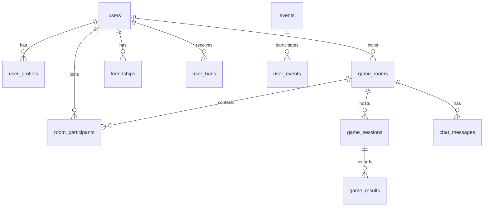

# Police Thief Game Database Design

## 📊 Database Architecture Overview

Police Thief 게임을 위한 고성능 MariaDB 데이터베이스 스키마입니다.
현재 Redis 기반 시스템을 SQL로 마이그레이션하면서 성능과 확장성을 모두 고려했습니다.

## 🎯 Design Goals

- **Performance**: 12,000+ QPS 처리 (Redis 수준)
- **Scalability**: 500+ 동시 접속 지원
- **Reliability**: 트랜잭션 보장 및 데이터 일관성
- **Maintainability**: 명확한 스키마와 관계

## 📁 File Structure

```
sql/
├── schema.sql      # 전체 데이터베이스 스키마
├── indexes.sql     # 성능 최적화 인덱스
├── migration.sql   # Redis → MariaDB 마이그레이션
├── queries.sql     # 최적화된 쿼리 템플릿
└── README.md       # 이 문서
```

## 🗄️ Main Tables

### User Management
- `users` - 사용자 기본 정보
- `user_profiles` - 게임 통계 및 프로필
- `user_tokens` - JWT 인증 토큰

### Game Rooms
- `game_rooms` - 게임 룸 정보
- `room_participants` - 룸 참가자
- `game_sessions` - 게임 세션 기록
- `game_results` - 개인별 게임 결과

### Social Features
- `friendships` - 친구 관계
- `chat_messages` - 채팅 메시지 (파티션)

### Events & Rewards
- `events` - 이벤트 정의
- `user_events` - 사용자 이벤트 참여

### Moderation
- `user_bans` - 사용자 제재 기록

### Analytics
- `daily_statistics` - 일별 통계
- `activity_logs` - 활동 로그 (파티션)

## 🚀 Performance Features

### 1. Indexing Strategy
```sql
-- 커버링 인덱스로 디스크 I/O 최소화
CREATE INDEX idx_room_list_covering ON game_rooms(...)
INCLUDE (room_code, room_name, ...);

-- 파티셜 인덱스로 메모리 효율성
CREATE INDEX idx_ranking_winrate ON user_profiles(...)
WHERE total_games >= 10;
```

### 2. Partitioning
```sql
-- 시간 기반 파티셔닝으로 대용량 데이터 관리
PARTITION BY RANGE (UNIX_TIMESTAMP(created_at))
```

### 3. Caching
```sql
-- 메모리 테이블로 핫 데이터 캐싱
CREATE TABLE cached_rankings (...) ENGINE=MEMORY;

-- 쿼리 캐시 활용
SELECT SQL_CACHE ...
```

### 4. Batch Operations
```sql
-- 배치 인서트로 네트워크 오버헤드 감소
INSERT INTO game_results VALUES (...), (...), ...;
```

## 🔄 Migration from Redis

### Redis Key Mapping
| Redis Pattern | SQL Table | Notes |
|--------------|-----------|-------|
| `user:{id}` | `users` + `user_profiles` | 1:1 관계 |
| `room:info:{id}` | `game_rooms` | 룸 정보 |
| `room:list:time:index` | `game_rooms` ORDER BY | 정렬 인덱스 |
| `user:session:{token}` | `user_tokens` | JWT 관리 |

### Migration Process
1. Redis 데이터 덤프
2. JSON 형식으로 임시 테이블 로드
3. 저장 프로시저로 변환 및 삽입
4. 데이터 검증
5. 인덱스 재구성

## 📈 Performance Benchmarks

### Target Metrics
- **Query Response**: <5ms (cached), <20ms (complex)
- **Connection Pool**: 100-500 connections
- **Query Cache Hit**: >80%
- **Index Usage**: 100% for critical paths

### Optimization Tips
```sql
-- Prepared Statements 사용
PREPARE stmt FROM 'SELECT ... WHERE user_id = ?';

-- 힌트로 인덱스 강제
SELECT /*+ INDEX(users idx_users_login) */ ...

-- 배치 처리
INSERT INTO ... VALUES (...), (...) ON DUPLICATE KEY UPDATE ...
```

## 🛠️ Setup Instructions

### 1. Create Database
```bash
mysql -u root -p < schema.sql
```

### 2. Create Indexes
```bash
mysql -u root -p police_thief_game < indexes.sql
```

### 3. Setup Users
```sql
CREATE USER 'game_app'@'%' IDENTIFIED BY 'password';
GRANT SELECT, INSERT, UPDATE, DELETE, EXECUTE ON police_thief_game.* TO 'game_app'@'%';
```

### 4. Configure Connection Pool (Rust)
```rust
let pool = MySqlPoolOptions::new()
    .max_connections(100)
    .min_connections(10)
    .connect_timeout(Duration::from_secs(3))
    .connect(&database_url)
    .await?;
```

## 🔧 Maintenance

### Daily Tasks
- Statistics aggregation (자동)
- Token cleanup (매시간)
- Cache refresh (5분마다)

### Monthly Tasks
- Partition rotation
- Index optimization
- Slow query analysis

### Monitoring Queries
```sql
-- 실시간 성능
SELECT * FROM information_schema.processlist;

-- 슬로우 쿼리
SELECT * FROM mysql.slow_log WHERE query_time > 0.1;

-- 인덱스 사용률
SHOW INDEX FROM game_rooms;
```

## 📊 ER Diagram



## 🔐 Security

### Data Protection
- Password hashing (bcrypt)
- SQL injection prevention (prepared statements)
- Row-level security for sensitive data

### Access Control
- Read/write separation
- Role-based permissions
- Connection encryption (SSL/TLS)

## 📝 Best Practices

1. **Always use prepared statements**
2. **Implement connection pooling**
3. **Monitor slow queries**
4. **Regular index maintenance**
5. **Partition large tables**
6. **Use transactions for consistency**
7. **Implement retry logic**
8. **Cache frequently accessed data**

## 🚨 Common Issues

### High Latency
- Check index usage
- Analyze query execution plan
- Consider caching

### Lock Contention
- Use optimistic locking
- Reduce transaction scope
- Consider sharding

### Connection Exhaustion
- Increase pool size
- Optimize query time
- Implement circuit breaker

## 📚 References

- [MariaDB Performance Tuning](https://mariadb.com/kb/en/optimization-and-tuning/)
- [Database Indexing](https://use-the-index-luke.com/)
- [SQL Antipatterns](https://pragprog.com/titles/bksqla/sql-antipatterns/)

## 🤝 Contributing

데이터베이스 스키마 개선 제안은 언제든 환영합니다!

1. 성능 테스트 결과 첨부
2. 인덱스 영향 분석
3. 마이그레이션 계획 수립

---

*Last Updated: 2024-03-20*
*Version: 1.0.0*