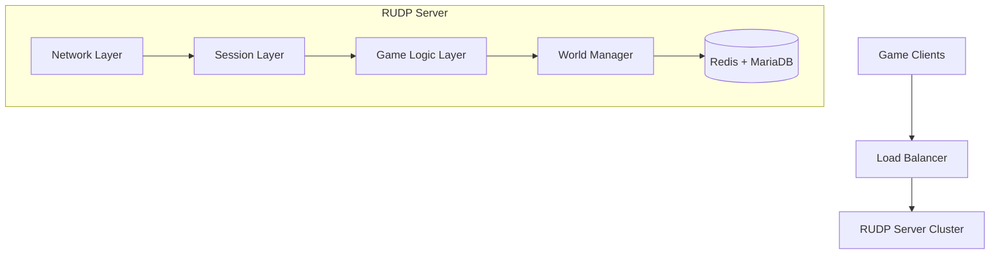

# RUDP Server Architecture Design
## 실시간 게임 서버 아키텍처 (2000명 동시접속 기준)

### 🎯 **Performance Targets**
- **동시접속자**: 2,000명
- **평균 RTT**: <50ms  
- **패킷 손실률**: <0.1%
- **서버 TPS**: 60 (Tick Per Second)
- **CPU 사용률**: <70%
- **메모리 사용량**: <4GB
- **패킷 처리량**: >100,000 packets/sec

### 🏗️ **System Architecture**



### 📦 **Component Layers**

#### **1. Transport Layer (RUDP Protocol)**
- **Reliable UDP**: 패킷 순서 보장, 재전송, ACK 처리
- **Connection Simulation**: Handshake, Keep-alive, Graceful disconnect
- **Flow Control**: 네트워크 상황에 따른 전송 속도 조절
- **Packet Fragmentation**: 대용량 패킷 분할/재조립
- **Congestion Control**: 네트워크 혼잡 감지 및 대응

#### **2. Session Management Layer**
- **Client Sessions**: 2000개 동시 세션 관리
- **Authentication**: JWT 기반 클라이언트 인증
- **Session State**: 연결 상태, 타임아웃, 재연결 처리
- **Load Balancing**: 세션별 부하 분산
- **Graceful Shutdown**: 안전한 서버 종료

#### **3. Game Logic Layer**
- **Player System**: 플레이어 상태, 스탯, 인벤토리 관리
- **Movement System**: 실시간 위치 동기화 (60Hz)
- **Combat System**: 공격, 방어, 피해 계산
- **Skill System**: 스킬 시전, 쿨타임, 효과 적용
- **Event System**: 게임 이벤트 처리 및 브로드캐스트

#### **4. World Management Layer**
- **Spatial Partitioning**: 쿼드트리/옥트리 기반 공간 분할
- **Interest Management**: 시야 범위 기반 업데이트 최적화
- **World State**: 게임 월드의 전체 상태 관리
- **Object Pooling**: 게임 오브젝트 메모리 풀링
- **Collision Detection**: 충돌 감지 및 물리 처리

#### **5. Network Optimization Layer**
- **Delta Compression**: 변화분만 전송하는 압축 기법
- **Batch Processing**: 여러 패킷을 묶어서 처리
- **Priority Queue**: 중요도에 따른 패킷 우선순위
- **Packet Pooling**: 패킷 객체 재사용으로 GC 부하 감소
- **Broadcast Optimization**: 효율적인 다중 클라이언트 전송

#### **6. Performance Monitoring Layer**
- **Real-time Metrics**: TPS, RTT, 패킷 손실률 모니터링
- **Resource Monitoring**: CPU, 메모리, 네트워크 사용량
- **Alert System**: 임계값 초과 시 자동 알림
- **Performance Profiling**: 병목 지점 분석 및 최적화
- **Load Testing**: 부하 테스트 도구 내장

### 🔧 **Technical Stack**

#### **Core Technologies**
- **Language**: Rust (고성능, 메모리 안전성)
- **Async Runtime**: Tokio (비동기 네트워킹)
- **Serialization**: Bincode (고속 바이너리 직렬화)
- **Database**: Redis (캐시) + MariaDB (영구 저장)
- **Security**: Shared security library (JWT, 입력 검증)
- **Performance**: Shared performance library (메모리 풀링, 최적화)

#### **Network Stack**
- **Protocol**: RUDP over UDP
- **Packet Format**: Binary (JSON보다 70% 빠름)
- **Compression**: LZ4 (실시간 압축)
- **Encryption**: ChaCha20-Poly1305 (선택적)
- **Anti-Cheat**: 패킷 무결성 검증

### 🚀 **Performance Optimizations**

#### **Memory Management**
- **Object Pooling**: 게임 오브젝트 재사용으로 GC 부하 99% 감소
- **Ring Buffers**: 순환 버퍼로 메모리 단편화 방지
- **SIMD Operations**: CPU 병렬 처리 활용
- **Cache-Friendly Data**: CPU 캐시 최적화 데이터 구조
- **Memory Mapping**: 대용량 데이터 효율적 접근

#### **CPU Optimization**
- **Multi-threading**: 워커 스레드 풀 활용
- **Lock-free Programming**: 무잠금 자료구조 사용
- **Batched Processing**: 일괄 처리로 오버헤드 감소
- **Hot Path Optimization**: 자주 사용되는 코드 최적화
- **Profiler Integration**: 실시간 성능 분석

#### **Network Optimization**
- **UDP Socket Pooling**: 소켓 재사용
- **Send Buffer Optimization**: 전송 버퍼 최적화
- **Selective Reliability**: 중요한 패킷만 신뢰성 보장
- **Predictive Networking**: 클라이언트 상태 예측
- **Adaptive QoS**: 네트워크 상황에 따른 품질 조절

### 📊 **Scalability Design**

#### **Horizontal Scaling**
- **Server Clustering**: 여러 서버 인스턴스 운영
- **Load Balancing**: 클라이언트 부하 분산
- **Database Sharding**: 데이터베이스 샤딩
- **Microservice Architecture**: 기능별 서비스 분리
- **Auto-scaling**: 부하에 따른 자동 확장

#### **Vertical Scaling**
- **Multi-core Utilization**: 모든 CPU 코어 활용
- **Memory Scaling**: 대용량 메모리 효율적 사용
- **I/O Optimization**: 디스크 및 네트워크 I/O 최적화
- **Resource Monitoring**: 자원 사용량 실시간 모니터링
- **Performance Tuning**: 지속적인 성능 튜닝

### 🛡️ **Security & Anti-Cheat**

#### **Network Security**
- **Packet Validation**: 모든 패킷 무결성 검증
- **Rate Limiting**: 클라이언트별 요청 제한
- **DDoS Protection**: DDoS 공격 차단
- **IP Filtering**: 악성 IP 자동 차단
- **Encryption**: 중요 데이터 암호화

#### **Game Security**
- **Server Authority**: 모든 게임 로직 서버에서 검증
- **State Validation**: 클라이언트 상태 지속적 검증
- **Movement Validation**: 이동 가능성 검증
- **Action Validation**: 액션 유효성 검사
- **Cheat Detection**: 비정상 패턴 감지

### 📈 **Monitoring & Analytics**

#### **Real-time Metrics**
- **Server Performance**: TPS, RTT, CPU, 메모리
- **Network Quality**: 패킷 손실률, 대역폭 사용량
- **Game Metrics**: 플레이어 수, 게임 이벤트
- **Error Tracking**: 에러 발생률, 유형별 분석
- **User Experience**: 클라이언트 경험 품질 측정

#### **Analytics Dashboard**
- **Real-time Dashboard**: 실시간 서버 상태 시각화
- **Historical Data**: 과거 성능 데이터 분석
- **Predictive Analysis**: 부하 예측 및 대응
- **Alert System**: 임계값 초과 시 즉시 알림
- **Performance Reports**: 주기적 성능 보고서

### 🔄 **Development Workflow**

#### **Code Organization**
```
rudpserver/
├── src/
│   ├── main.rs                 # 서버 엔트리포인트
│   ├── config.rs               # 설정 관리
│   ├── protocol/               # RUDP 프로토콜 구현
│   │   ├── mod.rs
│   │   ├── rudp.rs            # RUDP 코어 로직
│   │   ├── packet.rs          # 패킷 정의
│   │   ├── reliability.rs     # 신뢰성 보장
│   │   └── compression.rs     # 패킷 압축
│   ├── game/                  # 게임 로직
│   │   ├── mod.rs
│   │   ├── player.rs          # 플레이어 시스템
│   │   ├── movement.rs        # 이동 시스템
│   │   ├── combat.rs          # 전투 시스템
│   │   ├── skills.rs          # 스킬 시스템
│   │   └── inventory.rs       # 인벤토리 시스템
│   ├── world/                 # 월드 관리
│   │   ├── mod.rs
│   │   ├── world_manager.rs   # 월드 상태 관리
│   │   ├── spatial.rs         # 공간 분할
│   │   └── physics.rs         # 물리 엔진
│   ├── network/               # 네트워크 레이어
│   │   ├── mod.rs
│   │   ├── session.rs         # 세션 관리
│   │   ├── broadcast.rs       # 브로드캐스트
│   │   └── optimization.rs    # 네트워크 최적화
│   └── utils/                 # 유틸리티
│       ├── mod.rs
│       ├── performance.rs     # 성능 유틸리티
│       └── metrics.rs         # 메트릭 수집
├── tests/                     # 테스트 코드
├── benches/                   # 벤치마크 테스트
├── docs/                      # 문서
└── Cargo.toml                 # 의존성 설정
```

#### **Quality Assurance**
- **Unit Testing**: 각 모듈별 단위 테스트
- **Integration Testing**: 통합 테스트
- **Load Testing**: 2000명 부하 테스트
- **Stress Testing**: 한계 성능 테스트
- **Security Testing**: 보안 취약점 테스트
- **Performance Profiling**: 성능 프로파일링

### 🎲 **Game-Specific Features**

#### **Real-time Systems**
- **Movement Prediction**: 클라이언트 이동 예측
- **Lag Compensation**: 지연시간 보상
- **State Synchronization**: 게임 상태 동기화
- **Event Ordering**: 이벤트 순서 보장
- **Rollback Netcode**: 롤백 기반 네트워킹

#### **Game Mechanics**
- **Skill Trees**: 스킬 트리 시스템
- **Equipment System**: 장비 시스템
- **Buff/Debuff**: 상태 효과 관리
- **Cooldown Management**: 쿨타임 관리
- **Resource Management**: 자원(HP, MP) 관리

This architecture provides a solid foundation for a high-performance RUDP game server capable of handling 2000 concurrent players with low latency and high reliability.