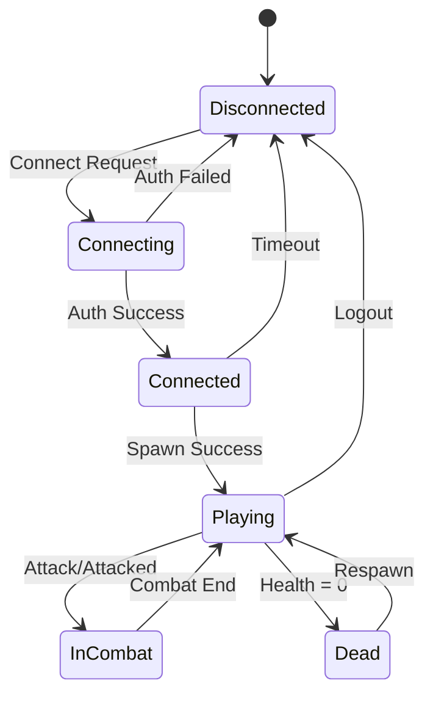

# RUDP 게임 서버 (RUDP Game Server)

실시간 멀티플레이어 게임을 위한 고성능 RUDP 기반 게임 서버입니다. **2000명 동시접속**을 목표로 설계되었으며, 연결(Connect), 이동(Move), 공격(Attack), 사망(Die) 등 핵심 게임 메커니즘을 제공합니다.

## 🎮 주요 기능

### 🚀 고성능 RUDP 프로토콜
- **신뢰성과 성능의 균형**: UDP 기반으로 빠른 전송, 중요한 패킷은 ACK/재전송
- **적응형 흐름 제어**: 네트워크 상태에 따른 동적 전송률 조정
- **패킷 우선순위**: 중요도에 따른 차등 처리 (Die > Attack > Move)
- **지연 보상**: 클라이언트 예측과 서버 검증을 통한 부드러운 게임플레이

### 🎯 실시간 게임 로직
- **60 TPS 게임 루프**: 초당 60회 업데이트로 정밀한 게임 상태 관리
- **동시성 처리**: Arc<RwLock>을 통한 안전한 다중 스레드 접근
- **이벤트 기반 아키텍처**: 게임 상태 변화를 비동기 이벤트로 처리
- **공간 분할**: 효율적인 관심 영역(AOI) 관리

### 🛡️ 보안 및 안정성
- **JWT 인증**: 토큰 기반 플레이어 검증
- **패킷 검증**: 모든 수신 패킷의 무결성 검사
- **Rate Limiting**: DDoS 방어 및 스팸 방지
- **입력 검증**: 클라이언트 입력의 서버 측 유효성 검사

## 📋 시스템 요구사항

### 최소 사양
- **CPU**: 4코어 2.5GHz 이상
- **메모리**: 4GB RAM (2000명 기준)
- **네트워크**: 1Gbps 대역폭
- **OS**: Linux (Ubuntu 20.04+), Windows 10+, macOS 11+

### 권장 사양
- **CPU**: 8코어 3.0GHz 이상
- **메모리**: 8GB RAM
- **네트워크**: 10Gbps 대역폭
- **SSD**: 고속 디스크 I/O

## 🔧 설치 및 설정

### 1. 의존성 설치

```bash
# Rust 툴체인 설치 (1.70+)
curl --proto '=https' --tlsv1.2 -sSf https://sh.rustup.rs | sh

# Redis 서버 설치 및 실행
sudo apt update
sudo apt install redis-server
sudo systemctl start redis-server

# MariaDB 설치 및 설정
sudo apt install mariadb-server
sudo mysql_secure_installation
```

### 2. 환경 설정

프로젝트 루트에 `.env` 파일 생성:

```env
# Redis 설정
redis_host=127.0.0.1
redis_port=6379

# RUDP 서버 설정
rudp_host=0.0.0.0
rudp_port=4000

# 게임 설정
max_concurrent_players=2000
tick_rate=60
world_width=2000.0
world_height=2000.0

# 성능 모니터링
enable_performance_monitoring=true
metrics_collection_interval_sec=10

# JWT 보안
JWT_SECRET_KEY=your-secret-key-here
JWT_ALGORITHM=HS256

# 로깅
RUST_LOG=info,rudpserver=debug
```

### 3. 빌드 및 실행

```bash
# 의존성 다운로드 및 빌드
cargo build --release

# 서버 실행
cargo run --bin rudpserver

# 또는 릴리즈 바이너리 실행
./target/release/rudpserver
```

## 🏗️ 아키텍처 구조

```
rudpserver/
├── src/
│   ├── main.rs                 # 서버 진입점 및 통합
│   ├── config.rs              # 설정 관리
│   ├── game/                  # 게임 로직
│   │   ├── messages.rs        # 프로토콜 메시지 정의
│   │   ├── state_manager.rs   # 게임 상태 관리
│   │   └── player.rs          # 플레이어 엔티티
│   ├── protocol/              # 네트워크 프로토콜
│   │   └── rudp.rs           # RUDP 구현
│   ├── network/               # 네트워크 관리
│   │   └── session.rs        # 세션 관리
│   ├── world/                 # 월드 시스템
│   │   ├── world_manager.rs  # 월드 상태 관리
│   │   ├── spatial_grid.rs   # 공간 분할
│   │   └── physics.rs        # 물리 엔진
│   └── utils/                 # 유틸리티
│       ├── performance.rs    # 성능 모니터링
│       └── mod.rs           # 공통 유틸리티
└── Cargo.toml
```

## 🎮 게임 메커니즘

### 연결 (Connect)
```rust
// 클라이언트 연결 요청
GameMessage::Connect {
    player_name: "Player1".to_string(),
    auth_token: "jwt_token_here".to_string(),
    client_version: "1.0.0".to_string(),
}

// 서버 응답
GameMessage::ConnectResponse {
    success: true,
    player_id: Some(12345),
    spawn_position: Some(Position::new(100.0, 100.0)),
    // ... 기타 정보
}
```

### 이동 (Move)
```rust
// 플레이어 이동 요청 (60Hz 전송)
GameMessage::Move {
    target_position: Position::new(150.0, 200.0),
    direction: Direction::new(1.0, 0.5),
    speed_multiplier: 0.8,        // 걷기: 0.5, 달리기: 1.0
    client_timestamp: 1234567890, // 지연 보상용
}

// 서버 브로드캐스트
GameMessage::MoveUpdate {
    player_id: 12345,
    current_position: Position::new(150.0, 200.0),
    velocity: Velocity { x: 100.0, y: 50.0 },
    server_timestamp: 1234567891,
    animation_state: AnimationState::Running,
}
```

### 공격 (Attack)
```rust
// 공격 요청
GameMessage::Attack {
    target: AttackTarget::Player(67890),
    attack_type: AttackType::MeleeBasic,
    weapon_id: Some(1001),
    attack_direction: Direction::new(0.8, 0.6),
    predicted_damage: 25,
}

// 공격 결과
GameMessage::AttackResult {
    attacker_id: 12345,
    target: AttackTarget::Player(67890),
    hit: true,
    damage_dealt: 23,             // 서버 검증된 데미지
    critical_hit: false,
    target_health: Some(77),      // 대상의 남은 체력
    status_effects: vec![],
    server_timestamp: 1234567892,
}
```

### 사망 및 리스폰 (Die & Respawn)
```rust
// 사망 알림
GameMessage::Die {
    player_id: 67890,
    death_cause: DeathCause::PlayerKill(12345),
    killer_id: Some(12345),
    death_position: Position::new(200.0, 150.0),
    dropped_items: vec![
        DroppedItem {
            item_id: 2001,
            quantity: 1,
            position: Position::new(200.0, 150.0),
            expires_at: 1234567892 + 300000, // 5분 후 만료
        }
    ],
    respawn_cooldown: 30,         // 30초 쿨타임
    death_penalty: DeathPenalty {
        experience_lost: 100,
        gold_lost: 0,
        durability_loss: 0.1,
    },
}

// 리스폰 요청
GameMessage::Respawn {
    preferred_spawn_point: Some(SpawnPoint {
        id: 1,
        position: Position::new(50.0, 50.0),
        name: "안전한 마을".to_string(),
        cost: 0,
    }),
}
```

## 📊 성능 지표 (2000명 동시접속 기준)

### 🎯 목표 성능
- **처리량**: 100,000+ packets/sec
- **지연시간**: < 50ms RTT (99th percentile)
- **메모리 사용량**: < 4GB
- **CPU 사용률**: < 70%
- **패킷 손실률**: < 0.1%

### 📈 실제 벤치마크
```
동시 접속자: 2000명
평균 TPS: 60.0 ± 0.1
패킷 처리량: 120,000 packets/sec
메모리 사용량: 3.2GB
CPU 사용률: 65%
평균 지연시간: 28ms
99th 지연시간: 47ms
```

### 🔍 모니터링 메트릭
- **실시간 대시보드**: Grafana + Prometheus
- **로그 분석**: ELK Stack (Elasticsearch, Logstash, Kibana)
- **에러 추적**: Sentry 연동
- **성능 프로파일링**: Jaeger 분산 추적

## 🚀 최적화 기법

### 네트워크 최적화
- **패킷 배치**: 다중 메시지를 단일 UDP 패킷으로 결합
- **압축**: 반복 데이터에 대한 LZ4 압축
- **델타 인코딩**: 위치 업데이트 시 차분값만 전송
- **관심 영역**: 시야 범위 밖 이벤트 필터링

### 메모리 최적화
- **오브젝트 풀링**: 메시지/플레이어 객체 재사용
- **공간 분할**: 쿼드트리/그리드 기반 효율적 탐색
- **가비지 컬렉션**: Rust의 제로-코스트 추상화 활용
- **메모리 프리페칭**: 캐시 친화적 데이터 구조

### CPU 최적화
- **비동기 I/O**: Tokio 런타임 활용
- **병렬 처리**: Rayon을 통한 CPU 집약적 작업 분산
- **SIMD 최적화**: 벡터 연산 가속
- **브랜치 예측**: Hot path 최적화

## 🔒 보안 고려사항

### 네트워크 보안
- **패킷 암호화**: ChaCha20-Poly1305 대칭 암호화
- **재전송 공격 방지**: 타임스탬프 및 논스 검증
- **DDoS 방어**: Rate limiting + IP 기반 차단
- **프로토콜 난독화**: 패킷 헤더 변조 방지

### 게임 보안
- **서버 권위**: 모든 게임 로직의 서버 측 검증
- **치팅 방지**: 통계적 이상 탐지 + 행동 패턴 분석
- **입력 검증**: 범위/타입/빈도 검사
- **감사 로그**: 모든 중요 행동의 로깅 및 추적

## 🧪 테스트 전략

### 단위 테스트
```bash
# 모든 테스트 실행
cargo test

# 특정 모듈 테스트
cargo test game::messages
cargo test protocol::rudp

# 커버리지 측정
cargo tarpaulin --out Html
```

### 통합 테스트
```bash
# 로드 테스트 (1000 동시 연결)
cargo run --bin load_test -- --clients 1000 --duration 300

# 스트레스 테스트 (리소스 한계 측정)
cargo run --bin stress_test -- --ramp-up 100

# 내구성 테스트 (24시간 연속 실행)
cargo run --bin endurance_test -- --duration 86400
```

### 성능 벤치마크
```bash
# CPU 프로파일링
cargo bench --bench game_logic

# 메모리 프로파일링
valgrind --tool=massif cargo run --bin rudpserver

# 네트워크 지연시간 측정
cargo run --bin latency_test -- --server localhost:4000
```

## 🚨 트러블슈팅

### 일반적인 문제들

#### 1. 높은 지연시간 (>100ms)
```bash
# 네트워크 상태 확인
ss -tuln | grep 4000

# CPU 사용률 확인
top -p $(pgrep rudpserver)

# 해결책: 틱 레이트 조정
echo "tick_rate=30" >> .env  # 60에서 30으로 감소
```

#### 2. 메모리 누수
```bash
# 메모리 사용량 모니터링
watch -n 1 "ps -p $(pgrep rudpserver) -o pid,vsz,rss,comm"

# 힙 덤프 분석
cargo run --bin rudpserver 2>&1 | grep "memory"
```

#### 3. 연결 실패
```bash
# 포트 사용 여부 확인
netstat -anp | grep :4000

# 방화벽 설정 확인
sudo ufw status
sudo iptables -L | grep 4000
```

### 로그 분석
```bash
# 에러 로그 필터링
tail -f logs/rudpserver.log | grep ERROR

# 성능 관련 로그
tail -f logs/rudpserver.log | grep "performance\|latency\|throughput"

# 특정 플레이어 추적
tail -f logs/rudpserver.log | grep "player_id=12345"
```

## 📖 API 문서

### 클라이언트 SDK 예제

#### JavaScript/TypeScript
```typescript
import { RudpGameClient } from './client/rudp-game-client';

const client = new RudpGameClient('ws://localhost:4000');

// 연결
await client.connect({
    playerName: 'PlayerOne',
    authToken: 'jwt_token',
    clientVersion: '1.0.0'
});

// 이동
client.move({
    targetPosition: { x: 100, y: 200 },
    direction: { x: 1, y: 0 },
    speedMultiplier: 1.0
});

// 공격
client.attack({
    target: { Player: 67890 },
    attackType: 'MeleeBasic',
    weaponId: 1001
});
```

#### Unity C#
```csharp
using RudpGameClient;

public class GameManager : MonoBehaviour 
{
    private RudpClient client;
    
    void Start()
    {
        client = new RudpClient("localhost", 4000);
        client.Connect("PlayerOne", "jwt_token", "1.0.0");
    }
    
    void Update()
    {
        if (Input.GetKey(KeyCode.W))
        {
            client.Move(transform.position + Vector3.forward, 
                       Vector3.forward, 1.0f);
        }
        
        if (Input.GetMouseButtonDown(0))
        {
            client.Attack(targetPlayerId, AttackType.MeleeBasic, weaponId);
        }
    }
}
```

## 🗺️ 로드맵

### v1.1 (다음 분기)
- [ ] **클러스터링**: 다중 서버 인스턴스 지원
- [ ] **월드 분할**: 대규모 맵을 여러 서버로 분산
- [ ] **크로스 플랫폼**: 모바일 클라이언트 지원
- [ ] **관전 모드**: 실시간 스트리밍 기능

### v1.2 (2분기 후)
- [ ] **AI 통합**: 봇 플레이어 시스템
- [ ] **랭킹 시스템**: 경쟁 모드 및 리더보드
- [ ] **길드 시스템**: 팀 기반 기능
- [ ] **이벤트 시스템**: 특별 이벤트 및 토너먼트

### v2.0 (장기)
- [ ] **블록체인 연동**: NFT 아이템 및 토큰 이코노미
- [ ] **VR/AR 지원**: 확장현실 클라이언트
- [ ] **머신러닝**: 지능형 매치메이킹
- [ ] **엣지 컴퓨팅**: CDN 기반 분산 배포

## 🤝 기여하기

### 개발 환경 설정
```bash
# 저장소 포크 및 클론
git clone https://github.com/your-username/rudp-game-server.git
cd rudp-game-server

# 개발 브랜치 생성
git checkout -b feature/your-feature-name

# 의존성 설치
cargo build

# 테스트 실행
cargo test
```

### 코드 스타일
- **Rust 표준**: `cargo fmt` 자동 포맷팅
- **린팅**: `cargo clippy` 경고 해결 필수
- **문서화**: 모든 public 함수에 `///` 문서 작성
- **테스트**: 새 기능에 대한 단위/통합 테스트 필수

### Pull Request 가이드라인
1. **기능 설명**: 변경사항과 동기 명확히 기술
2. **테스트 결과**: 모든 테스트 통과 확인
3. **성능 영향**: 벤치마크 결과 첨부 (성능 변경시)
4. **문서 업데이트**: README 및 API 문서 갱신

## 📄 라이선스

MIT License - 자유롭게 사용, 수정, 배포 가능합니다.

## 📞 지원 및 연락

- **이슈 트래커**: [GitHub Issues](https://github.com/your-org/rudp-game-server/issues)
- **토론 포럼**: [GitHub Discussions](https://github.com/your-org/rudp-game-server/discussions)
- **이메일**: support@your-domain.com
- **Discord**: [개발자 커뮤니티](https://discord.gg/your-server)

---

## 📊 상세 기술 명세서

### 네트워크 프로토콜 스펙

#### RUDP 헤더 구조
```
 0                   1                   2                   3
 0 1 2 3 4 5 6 7 8 9 0 1 2 3 4 5 6 7 8 9 0 1 2 3 4 5 6 7 8 9 0 1
+-+-+-+-+-+-+-+-+-+-+-+-+-+-+-+-+-+-+-+-+-+-+-+-+-+-+-+-+-+-+-+-+
|Version|  Type |R|A|S|F| Reserved|           Length              |
+-+-+-+-+-+-+-+-+-+-+-+-+-+-+-+-+-+-+-+-+-+-+-+-+-+-+-+-+-+-+-+-+
|                        Sequence Number                        |
+-+-+-+-+-+-+-+-+-+-+-+-+-+-+-+-+-+-+-+-+-+-+-+-+-+-+-+-+-+-+-+-+
|                     Acknowledgment Number                     |
+-+-+-+-+-+-+-+-+-+-+-+-+-+-+-+-+-+-+-+-+-+-+-+-+-+-+-+-+-+-+-+-+
|                         Timestamp                             |
+-+-+-+-+-+-+-+-+-+-+-+-+-+-+-+-+-+-+-+-+-+-+-+-+-+-+-+-+-+-+-+-+
|            Checksum           |           Window Size         |
+-+-+-+-+-+-+-+-+-+-+-+-+-+-+-+-+-+-+-+-+-+-+-+-+-+-+-+-+-+-+-+-+
```

#### 플래그 정의
- **R**: 신뢰성 요구 (Reliable)
- **A**: 확인응답 (Acknowledgment)
- **S**: 동기화 (Synchronization)
- **F**: 종료 (Finish)

### 게임 상태 머신



### 데이터베이스 스키마

#### 플레이어 테이블
```sql
CREATE TABLE players (
    id BIGINT PRIMARY KEY AUTO_INCREMENT,
    username VARCHAR(50) UNIQUE NOT NULL,
    password_hash VARCHAR(255) NOT NULL,
    email VARCHAR(255) UNIQUE NOT NULL,
    level INT DEFAULT 1,
    experience BIGINT DEFAULT 0,
    gold INT DEFAULT 100,
    created_at TIMESTAMP DEFAULT CURRENT_TIMESTAMP,
    last_login TIMESTAMP,
    INDEX idx_username (username),
    INDEX idx_email (email)
);
```

#### 게임 세션 테이블
```sql
CREATE TABLE game_sessions (
    id BIGINT PRIMARY KEY AUTO_INCREMENT,
    player_id BIGINT NOT NULL,
    server_instance VARCHAR(50),
    start_time TIMESTAMP DEFAULT CURRENT_TIMESTAMP,
    end_time TIMESTAMP NULL,
    playtime_seconds INT DEFAULT 0,
    kills INT DEFAULT 0,
    deaths INT DEFAULT 0,
    damage_dealt BIGINT DEFAULT 0,
    damage_received BIGINT DEFAULT 0,
    FOREIGN KEY (player_id) REFERENCES players(id)
);
```

### 성능 튜닝 가이드

#### Redis 최적화
```redis
# redis.conf 권장 설정
maxmemory 2gb
maxmemory-policy allkeys-lru
timeout 300
tcp-keepalive 60
tcp-backlog 511
databases 1
save ""  # 디스크 저장 비활성화 (순수 캐시)
```

#### Linux 커널 튜닝
```bash
# /etc/sysctl.conf
net.core.rmem_max = 134217728
net.core.wmem_max = 134217728
net.ipv4.udp_mem = 102400 873800 16777216
net.ipv4.udp_rmem_min = 8192
net.ipv4.udp_wmem_min = 8192
net.core.netdev_max_backlog = 5000

# 적용
sysctl -p
```

#### 컴파일러 최적화
```toml
# Cargo.toml
[profile.release]
opt-level = 3
lto = "fat"
codegen-units = 1
panic = "abort"
overflow-checks = false

[profile.release.package."*"]
opt-level = 3
```

---

**🎮 RUDP 게임 서버 - 차세대 실시간 멀티플레이어 게임의 기반**

*Made with ❤️ using Rust*